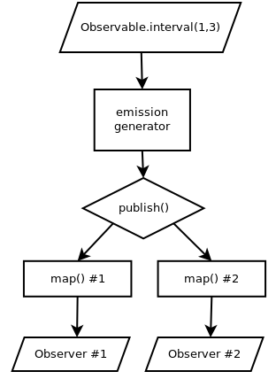
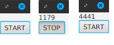

### Что это такое

Это конспект-перевод книги Томаса Нилда "Learning RxJava", 2017

<ul>

</ul>

-----

### Структура

Для того, чтобы упростить навигацию по материалу, была сохранена оригинальная структура книги: все оглавления и заголовки остались в родном виде.

- [Chapter 2: Observables and Subscribers](#observables-and-subscribers)
    - [The Observable](#observable)
        - How Observables work
        - Using Observable.create()
        - Using Observable.just()
    - [The Observer interface](#Интерфейс-observer)
        - Implementing and subscribing to an Observer
        - Shorthand Observers with lambdas
    - [Cold versus hot Observables](#cold-vs-hot)
        - Cold Observables
        - Hot Observables
        - ConnectableObservable
    - [Other Observable sources](#Другие-фабрики-для-создания-Observable)
        - Observable.range()
        - Observable.interval()
        - Observable.future()
        - Observable.empty()
        - Observable.never()
        - Observable.error()
        - Observable.defer()
        - Observable.fromCallable()
    - [Single, Completable, and Maybe](#single-completable-maybe)
        - Single
        - Maybe
        - Completable
    - [Disposing](#disposing)
        - Handling a Disposable within an Observer
        - Using CompositeDisposable
        - Handling Disposal with Observable.create()

- [Chapter 3: Basic Operators](#basic-operators)
    - [Suppressing operators](#suppressing-operators)
        - filter()
        - take()
        - skip()
        - takeWhile() and skipWhile()
        - distinct()
        - distinctUntilChanged()
        - elementAt()
    - [Transforming operators](#transforming-operators)
        - map()
        - cast()
        - startWith()
        - defaultIfEmpty()
        - switchIfEmpty()
        - sorted()
        - delay()
        - repeat()
        - scan()
    - [Reducing operators](#reducing-operators)
        - count()
        - reduce()
        - all()
        - any()
        - contains()
    - [Collection operators](#collection-operators)
        - toList()
        - toSortedList()
        - toMap() and toMultiMap()
        - collect()
    - [Error recovery operators](#error-recovery-operators)
        - onErrorReturn() and onErrorReturnItem()
        - onErrorResumeNext()
        - retry()
    - [Action operators](#action-operators)
        - doOnNext(), doOnComplete(), and doOnError()
        - doOnSubscribe() and doOnDispose()
        - doOnSuccess()

- [Chapter 4: Combining Observables](#combining-observables)
    - [Merging](#merging)
        - Observable.merge() and mergeWith()
        - flatMap()
    - [Concatenation](#concatenation)
        - Observable.concat() and concatWith()
        - concatMap()
    - [Ambiguous](#ambiguous)
    - [Zipping](#zipping)
    - [Combine latest](#combine-latest)
        - withLatestFrom()
    - [Grouping](#grouping)

- [Chapter 5: Multicasting, Replaying, and Caching](#multicasting-replaying-and-caching)
    - [Understanding multicasting](#understanding-multicasting)
        - Multicasting with operators
        - When to multicast
    - [Automatic connection](#automatic-connection)
        - autoConnect()
        - refCount() and share()
    - [Replaying and caching](#replaying-and-caching)
        - Replaying
        - Caching
    - [Subjects](#subjects)
        - PublishSubject
        - When to use Subjects
        - When Subjects go wrong
        - Serializing Subjects
        - BehaviorSubject
        - ReplaySubject
        - AsyncSubject
        - UnicastSubject

- [Chapter 6: Concurrency and Parallelization](#concurrency-and-parallelization)
    - Why concurrency is necessary
    - Concurrency in a nutshell
        - Understanding parallelization
    - [Introducing RxJava concurrency](#introducing-rxjava-concurrency)
        - Keeping an application alive
    - [Understanding Schedulers](#understanding-schedulers)
        - Computation
        - IO
        - New thread
        - Single
        - Trampoline
        - ExecutorService
        - Starting and shutting down Schedulers
    - [Understanding subscribeOn()](#understanding-subscribeon)
        - Nuances of subscribeOn()
    - [Understanding observeOn()](#understanding-observeon)
        - Using observeOn() for UI event threads
        - Nuances of observeOn()
    - [Parallelization](#parallelization)
    - [unsubscribeOn()](#unsubscribeon)

- [Chapter 7: Switching, Throttling, Windowing, and Buffering](#switching-throttling-windowing-and-buffering)
    - [Buffering](#buffering)
        - Fixed-size buffering
        - Time-based buffering
        - Boundary-based buffering
    - [Windowing](#windowning)
        - Fixed-size windowing
        - Time-based windowing
        - Boundary-based windowing
    - [Throttling](#throttling)
        - throttleLast() / sample()
        - throttleFirst()
        - throttleWithTimeout() / debounce()
    - [Switching](#switching)
    - [Grouping keystrokes](#grouping-keystrokes)

- [Chapter 8: Flowables and Backpressure](#flowables-and-backpressure)
    - [Understanding backpressure](#understanding-backpressure)
        - An example that needs backpressure
        - Introducing the Flowable
        - When to use Flowables and backpressure
            - Use an Observable If...
            - Use a Flowable If...
    - [Understanding the Flowable and Subscriber](#understanding-the-flowable-and-subscriber)
        The Subscriber
    - [Creating a Flowable](#creating-a-flowable)
        Using Flowable.create() and BackpressureStrategy
        Turning an Observable into a Flowable (and vice-versa)
    - [Using onBackpressureXXX() operators](#using-onbackpressurexxx-operators)
        - onBackPressureBuffer()
        - onBackPressureLatest()
        - onBackPressureDrop()
    - [Using Flowable.generate()]

- [Chapter 9: Transformers and Custom Operators](#transformers-and-custom-operators)
    - [Transformers](#transformers)
        - ObservableTransformer
        - FlowableTransformer
        - Avoiding shared state with Transformers
    - [Using to() for fluent conversion](#using-to-for-fluent-conversation)
    - [Operators](#operators)
        - Implementing an ObservableOperator
        - FlowableOperator
    - [Custom Transformers and operators for Singles, Maybes, and Completables](#custom-transformers-and-operators-for-singles-maybes-and-completables)
    - [Using RxJava2-Extras and RxJava2Extensions](#using-rxjava2-extras-and-rxjava2extensions)

- [Chapter 10: Testing and Debugging](#testing-and-debugging)
    - [Configuring JUnit](#configuring-junit)
    - [Blocking subscribers](#blocking-subscribers)
    - [Blocking operators](#blocking-operators)
        - blockingFirst()
        - blockingGet()
        - blockingLast()
        - blockingIterable()
        - blockingForEach()
        - blockingNext()
        - blockingLatest()
        - blockingMostRecent()
    - [Using TestObserver and TestSubscriber](#using-testobserver-and-testsubscriber)
    - [Manipulating time with the TestScheduler](#manipulating-time-with-the-testscheduler)
    - [Debugging RxJava code](#debugging-rxjava-code)

- [Chapter 11: RxJava on Adroid](#rxjava-on-android)

- [Chapter 12: Using RxJava for Kotlin New](#using-rxjava-for-kotlin-new)

-----

### Observables and Subscribers
Фундаментальная идея в основе реактивного программирования: события - это данные, данные - это события.

#### `Observable`
 
- `onNext()` - передаёт каждый элемент вниз до `Observer`.
- `onComplete()` - свидетельствует о том, что никаких `onNext()` больше не будет.
- `onError()` - отправляет ошибку вниз по цепочке вплоть до самого `Observer`, где , как правило, определена обработка ошибок. Если не использован оператор `retry()` или один из [методов](https://github.com/ReactiveX/RxJava/wiki/Error-Handling-Operators) вида `onErrorResumeNext()`, то по контракту больше никаких элементов не заэмитится.
 
`Observable.create()` -  фабрика, позволяющая создать `Observable` и обозначить эмиттер. Нужна для хуков вокруг нереактивных источников данных/событий. В первой **RxJava** это был `Observable.fromEmitter()`. Стоит обратить внимание, что `Observable` одновременно может эмитить _только один элемент_. `map()` и `filter()` возвращают новый `Observable`.

Во второй **RxJava** нельзя эмиттить Null.

#### Интерфейс `Observer`
Методы `onNext()`, `onComplete()`, `onError()` определяют тип обзёрвера. В первой эрыксджаве это был `Subscriber`. Во второй `Subscriber` появляется только когда речь идёт о `Flowables`. Если при выпуске элементов в `Observable` произойдёт ошибка, то она упадёт в `Observer.onError()`.
    
#### Функции в rxJava (аналогично Java8)

Имя | single-abstract-method | Описание
--------|---------|-----------
`Action` | `run()` | Запускает операцию, похоже на `Runnable`
`Callable<T>`	| `get()` | Возвращает элемент типа `T`
`Consumer<T>` | `accept()` | Что-то делает над `T`, ничего не возвращает
`Function<T,R>` | `apply()` | Принимает `T`, возвращает `R`
`Predicate<T>` | `test()` | Принимает `Т`, возвращает `boolean`
`BiConsumer<T1,T2>` | `accept()` | см.`Consumer<T>`
`BiFunction<T1,T2,R>` | `apply()` | Принимает `T1`, `T2`, возвращает `R`
`BiPredicate<T1,T2>`	| `test()` | см.`Predicate<T>`
`Function3<T1,T2,T3,R>` | `apply()` | Принимает три аргумента, возвращает `R`
`BooleanSupplier` | `getAsBoolean()` | Возвращает булю
`LongConsumer` | `accept()` | Что-то делает с входным лонгом и всё
`IntFunction` | `apply()` |	Принимает `int` и возвращает `T`	
			
#### Cold vs Hot
Обсерваблы, которые эмитят конечные данные чаще всего _cold_ (отрабатывают тогда, когда на них подписались). Горячие похожи на _broadcast_, вещают всем подписчикам.
Работает, как радио. Если пропустил трэк, его уже не услышишь. Горячие чаще всего отображают события, нежели какие-то данные.

`ConnectableObservable` - полезная форма горячего обзёрвабла. Он берёт любой Observable и делает из него _hot_, чтобы он эмитил всем подписчикам одновременно.
Просто вызови `publish()` у любого обзёрвабла и он вернёт `ConnectableObservable`.
Но subscribe на такой обзёрвабл не вызовет эмиты. У него надо вызвать `connect()`, чтобы тот начал пулять. То есть можно подписать несколько на `ConnectableObservable`, потом ткнуть `source.connect()`, и только тогда все подписчики получат свои данные. Такая фиговина более известна, как _Multicasting_.

#### Другие фабрики для создания Observable
- `Observable.range()` - для создания последовательности интов. Создаётся до тех пор, пока не будет достигнут конечный инт. Все инты передаются через `onNext()`, что неудивительно.

- `Observable.interval()` - _time-based_ обзёрвабл, который эмитит с заданным
интервалом. Бесконечный. _Cold_.

- `Observable.future()` - обёртка над `Future`.

- `Observable.empty()` - ничего не эмитит и вызывает `onComplete()`. Вместо *null*'ов.

- `Observable.never()` - похож на `empty()`, только никогда не вызывает `onComplete()`.

- `Observable.error()` - вызывает `onError()`.

- `Observable.defer()` - какая-то мощная фиговина, так как может создавать _separate state_(отдельное состояние) для каждого `Observable`. Ну например нам нужно подтягивать изменившееся состояние в обзёрвабл.

- `Observable.fromCallable()` - если нам надо произвести какое-то вычисление или операцию, а затем заэмитить его/её, можно просто вызвать `Observable.just()`.
Но иногда надо это проделать лениво. Также, если эта операция вызывает ошибку, лучше бы она её выкидывала только на момент выполнения чейна.
Более того, если в `Observable.just()` случится ошибка, то она не будет передана в `Observer`. Короче говоря, если то, что вы оборачиваете в `Observable` может вызывать ошибку, то оборачивать надо в `Observable.fromCallable()`.

#### Single, Completable, Maybe
Есть три разных типа обзёрваблов, которые эмитят ноль или один элемент.

- `Single` - эмитит, вот это поворот, один элемент. `onSuccess()` включает в себя `onNext()` и `onComplete()`. В лямбде, соответственно, ловится `onSuccess()` и `onError()`.

- `Maybe` - если количество элементов от 0 до 1.

- `Completable` - придуман для того, чтобы выполнять какое-то действие. Ничего не получает. Есть `onError()` и `onComplete()`.

#### Disposing
Когда мы вызываем `subscribe()`, создаётся поток и обрабатывает _emissions_ в цепочке. Для этого выделяются какие-то ресурсы. Слава Богу, `Observable` высвобождает эти ресурсы как только отрабатывает `onComplete()`. Но в случае, если у нас бесконечный или турбо долгий поток, нам может понадобится конкретный `dispose`.
Короче, нельзя доверять **GC** чистку толстых потоков, надо диспозить самому, чтобы избежать мемори ликов.
`Disposable` - это связующее звено между `Observable` и активным `Observer`. Можно вызывать его `dispose()` для того, чтобы прекратить эмитить элементы и высвободить все ресурсы, затраченные на их выпуск.

##### Disposable в обзёрвере
В `onSubscribe(Disposable d)` у обзёрвера передан `Disposable`. Это нужно для того, чтобы обзёрвер мог контролировать подписку и у него был вариант отписаться в любой момент. `Disposable` передаётся по всей цепочке обзёрваблов. Вообще, передача `Observer`'a в `subscribe()` не вернёт `Disposable` (rxJava сама захэндлит это вот всё), но если очень надо, то можно юзануть `subscribeWith(Disposable)`, тем самым получив дефолтный `Disposable`.

Использование `CompositeDisposable`. НужнО в случае, если у нас несколько подписок, а мы хотим манагить их (отписаться от всех разом, к примеру).

-----

### Basic Operators
Тут важно вкурить, что операторы сами являются `Observer`'ом для своего `Observable` выше по цепочке.

#### Suppressing operators
Эти операторы просто тупо не вызывают `onNext()`, если не проходит какое-то условие. Соответственно, элемент не проходит вниз по цепочке.

- `filter()` - принимает `Predicate<T>` для обзёрвабла `T`. Каждый эмишн мапится в булю, которая говорит - подходит данный эмишн к условию или нет. Эмишены `False` дальше не проходят. Если вообще нет подходящих вариантов, то вернётся пустой `Observable`, ферштейн?

- `take()` - у него несколько реализаций, тривиально.

- `skip()` - противоположно `take()`.

- `takeWhile()`, `skipWhile()` - принимает/пропускает, пока соответствует условию.

- `takeUntil()`, `skipUntil()` - принимают другой `Observable` в качестве параметра. Принимают/пропускают, пока другой обзёрвабл продолжает эмитить.

- `distinct()` - будет эмитить каждый уникальный элемент, но подавлять повторяющиеся. Сравнение работает на `hashcode()`/`equals()` выпускаемых объектов. Надо иметь в виду, что если если у нас дохрена уникальных элементов, то этот оператор будет есть память. Типа как если бы каждая подписка создавала `HashSet`, отслеживающий предыдущие выпущенные элементы. Можно также кинуть в `distinct()` лямбду, по которой будет отобран уникальный ключ.

- `distinctUntilChanged()` - полезная штуковина. Эмитит элементы, если входящие значения изменились. То есть она игнорит последовательно повторяющиеся элементы.
`2,2,3,3,3,1,1 -> 2,3,1`. Также принимает лямбду на вход, по которой собственно сравнивает элементы.

- `elementAt()` - можно получить специфичный эмишн по его id'шнику (`long` от 0 до `Long.MAX_VALUE`). Возвращает `Maybe<T>`. У него есть разные реализации:
	- `elementAtOrError()` -  вернёт `Single` или `Error` (в случае, если по данному индексу нифига нет).
	- `singleElement()` - вернёт Observable, обёрнутый в Maybe
	- `firstElement()` и `lastElement()`.

#### Transforming operators
- `map()` - для заданного `Observable<T>` меняет `T` на `R`, используя функцию `Function<T,R>`.
Конвертирует один-к-одному каждый эмишн. Если нужно конвертить один-к-нескольким эмишнов, то надо использовать `flatMap()` или `concatMap()`.

- `cast()` - _map-like_ оператор, который кастует каждый эмишн к заданному типу. Некий такой брут-форс для приведения типов. Лучше правильно юзать дженерики, разумеется.

- `startWith()` - позволяет нам впихнуть какой-нибудь эмишн, с которого начинаются другие эмишны.
Например, у нас есть `Observable<String>`,выпускающий элементы, которые мы хотим напечатать в менюшке. Можно использовать `startWith()`, чтобы сначала написать заголовок менюшки.
```
Observable.just("Чай", "Кофе", "Лимонад")
	.startWith("НАПИТКИ")
	.subscribe(System.out::println)
	
>output: 
		НАПИТКИ 
		Чай
		Кофе
		Лимонад
```
Если нам нужно больше, чем один элемент для старта, можно бахнуть

- `startWithArray()`, тогда отработают сначала элементы массива. Если нужно ждать выпуск всех эмишнов другого `Obsaervable`, стоит использовать `Observable.concat()` или `concatWith()`.

- `defaultIfEmpty()` - подставляет дефолт, если пусто. Вот это да.

- `switchIfEmpty()` - переключается на другой `Observable`, если предыдущий не заэмитил ни одного элемента.

- `sorted()` - если у нас есть конечный `Observable<T>`, который выпускает элементы `Comparable<T>`, можно юзать этот оператор, чтобы сортировать эмишены. Под капотом он соберёт все эмишены, а потом перевыпустит их в заданном порядке. Если применить к бесконечному `Observable`, получим `OutOfMemory`, естесна. Можно подать `Comparator` в качестве аргумента.

- `delay()` - собирает все элементы и выпускает затем один за одним с заданным интервалом. Так как оперирует на другом шедулере, то надо это иметь в виду и не тупить в посках выполненной операции. Она могла не успеть выполниться до завершения _main_-потока. Для применения продвинутого `delay()` можно подать в него другой `Observable`, и этот дилей отложит свои эмишены на время, пока данный обзёрвабл чё-нить не выпустит. Есть также такая штука, как `delaySubscription()`, которая откладывает подписку, а не выпуск эмишнов.

- `repeat()` - повторит подписку после `onComplete()` заданное количество раз. Есть ещё `repeatUntil()`, который принимает `BooleanSupplier` и продолжает повторения до тех пор, пока супплаер не выдаст `true`.

- `scan()` - _rolling_ аггрегатор. Аккумулирует каждый эмишн и добавляет его к следующему.

```java
Observable.just(5, 3, 7, 10)
	.scan((accumulator, next) -> accumulator + next)
	.subscribe(System.out::println)

>output: 5 8 15 25
```

Это не обязательно лепить для интеджеров, можно аккумулировать всё что угодно. Отличается от `reduce()` тем, что тот берёт один эмишн, когда отрабатывает `onComplete()`. Может использоваться в бесконечных обзёрваблах.

#### Reducing operators
Будут случаи, когда необходимо взять серии эмишенов и сконсолидировать их в один элемент (зачастую какой-нибудь `Single`). Для этого есть несколько операторов. Заметьте, что эти операторы работают только с конечным `Observable`, который вызывает `onComplete`.

- `count()` - простейший оператор для объединения множества эмишенов. Он подсчитает количество элементов и выпустит `Single`, когда отработает `onComplete()`. Если нужно посчитать эмишены на бесконечном обзёрвабле, юзать `scan()`.

- `reduce()` - синтаксически похож на `scan()`, но только выдаёт последнее саккумулированное значение. Может выдать `Single` или `Maybe` в зависимости от вашей имплементации. Например, если нужон общий интеджер:
```java
Observable.just(5, 3, 7, 10, 2, 14)
	.reduce((total, next) -> total + next)
	.subscribe(System.out::println)

>output: 41
```

- `all()` - эта хреновена проверяет, что все элементы подпадают под определённый критерий и возвращает `Single<Boolean>`. Как только один из элементов не совпадает, **сразу** возвращает `False`.
>Не тупи и запомни: если вызвать `all()` к пустому обзёрваблу, он выдаст `True`.

- `any()` - соответственно, если есть хотя бы один подходящий эмишн. 
>Кстати, если вызвать его у пустого обзёрвабла, то он выдаст `False`.

- `contains()` - тут всё просто: вырнёт булю, если в эмишеннах есть данный элемент. Работает на `hashCode()`/`equals()`.

#### Collection operators
Аккумулируют все эмишены и собирают в одну коллекцию, типа листа или мапы. Затем выплёвывают эту коллекцию. Являются на самом деле ещё одной формой  _reducing operators_, но достойны отдельного параграфа. Кстати да, не стоит злоупотреблять этими операторами, так как это может навредить вашей реактивщине: лучше обрабатывать ивенты один-за-другим, так же, как они эмитятся, нежели скидывать всё в кучу и потом разгребать её. Смысл эрыкса тогда?

- `toList()` - собирает все эмишены из `Observable<T>` в `List<T>` и выдаёт его в виде `Single<List<T>>`. После того, как `Observable` отстреливает `onComplete()`, лист пушится в обзёрвер. По дефолту, этот лист будет `ArrayList`'ом, можно передать _capacity_ и задать таким образом ограничение на количество элементов.

- `toSortedList()` - собирает в сортированный лист (работает на `Comparator`'ах). Соответственно, можно передать компаратор в качестве аргумента.

- `toMap()` - для заданного `Observable<T>` соберёт в `Map<K,T>`, где `K` - ключ, полученный из лямбды `Function<T,K>`.

```java
Observable.just("Раз", "Два", "Три")
	.toMap(s -> s.charAt(0))
	.subscribe(System.out::println)

>output: {Р=Раз, Д=Два, Т=Три}
```

Можно и посложнее смаппить, если в лямбду передать через запятую правило для `value`.

```java
... 
	.toMap(s-> s.charAt(0), String::length)
	.subscribe(..)

>output: {Р=3, Д=3, Т=3}
```

По дефолту `toMap()` использует `HashMap`, можно обеспечить `ConcurrentHashMap`: `.toMap(s-> s.charAt(0), String::length, ConcurrentHashMap::new)`.

- `toMultiMap()` поддерживает случаи, когда хэши совпадают. Значения в таком случае складываются в список.

- `collect()` - нужен, чтобы собрать элементы в специфическую коллекцию:
`.collect(HashSet::new, HashSet::add)` соберёт в `HashSet` и выдаст `Single<HashSet>`. Используйте `collect()` вместо `reduce()`, когда вы собираете эмишены в мутабельный объект, чтобы затем получить _sealed_ объект.
Хороший пример с **guava**:

```java
Observable.just("Оп", "Оп", "Опана")
// собрали в билдер все элементы
	.collect(ImmutableList::builder, ImmutableList::add)
// сбилдили неизменяемый гуавовский список
	.map(ImmutableList.Builder::build)
	.subscribe(..)
```

В общем `collect()` хорош для сбора элементов в любую "нестандартную"
для rxjava коллекцию.
        
#### Error recovery operators
Так, ну мы уже знаем про метод `onError()`, который пронизывает всю цепочку от `Observable` до `Observer`. После его срабатываения, поток завершает выполнение и никаких эмишенов больше не происходит. Но иногда нам надо перехватить ошибку _до_ того, как она провалится до `Observer`'a и поток завершится с ошибкой.

- `onErrorReturn()` и `onErrorReturnItem()` - когда нужно вернуть дефолтный элемент в случае ошибки. Принимает лямбду с `Throwable`'ом. Важно, где стоит в цепочке. Чтобы ловить ошибку, должен стоять после обзёрвабла, который выдал эту ошибку (логично, потому как каждый следующий член цепочки является `Observer`'ом предыдущего члена и `Observabl`'ом для следущего).

- `onErrorResumeNext()` - аналогичен предыдущим, только принимает ещё другой `Observable` в качестве параметра (который эмитится на случай ошибки). Можно по красоте бахнуть например `.onErrorResumeNext(Observable.empty())` и вызвать тем самым `onComplete()` в цепочке, где произошла ошибка. Искать только её потом устанем (прим.автора).

- `retry()` - переподписывается к `Observabl`'у в надежде, что ошибка рассосётся сама по себе. Есть несколько перегруженных методов. Можно, например, задать интом количество попыток. Можно пульнуть в него `Predicate<Throwable>` или `BiPredicate<Integer,Throwable>`, чтобы более точно описать случай, когда должен отработать `retry()`. `retryUntil()` будет пересабскрайбиться до тех пор, пока соотв. `BooleanSupplier` в лямбде выдаёт `false`. Есть также крутой `retryWhen()`. С его помощью можно применить композицию из задач для ретрая (к примеру, выставить `delay` для `retry`).

#### Action operators
Помогают при дебаге, улучшают понимание того, что собственно проиходит в чейне. Вставлять между целевым обзёрвером и его обзёрваблом (прим.автора).
	
- `doOnNext()` - позволяет брать эмишены предыдущего `Observable`'а. Что-то типа мини-обзёрвабла в середине цепочки. Он никак не меняет эмишены. С помощью `doOnNext()` мы просто создаём _side-effect_ для каждого ивента в цепочке. В этом примере мы просто выведем все стринги в консоль до того, как они упадут в оператор `map()`:

```java
Observable.just("One", "Four", "Twelve")
	.doOnNext(s -> System.out::println)
	.map(String::length)
	.subscribe(System.out::println)

>output: One 3 Four 4 Twelve 6
```

Есть также `doAfterNext()`, который предпринимет заданное действие _ПОСЛЕ_
того, как эмишн ушёл дальше по цепочке.

- `doOnComplete()` - срабатывает, когда чейн вызывает свой `onComplete()`. Может быть полезен в случае, когда нужно понять, какая часть цепочки отработала нормально и завершилась `onComplete()`. 
		
- `doOnError()` - соответственно, срабатывает, когда по цепочке пробрасывается ошибка. Опять же, полезно вставлять между операторами. Тут лучше с примером:

```java
Observable.just(5, 2, 4, 0, 3, 2, 8)
	.doOnError(e -> System.out.println("Source failed")
	.map(i -> 10/i)
	.doOnError(e -> System.out.prinln("Division failed!")
	.subscribe(i -> System.out::println,
				e -> System.out.println("Observer gets error");

> output: 2 5 2 Division failed! Observer gets error
```

То есть "Source failed" не отработал, так как не было выпущено никаких ошибок из `.just(...)`.
Есть также `doOnEach()`, где мы можем определить действие для всех трёх предыдущих операторов. Это типа как влепить `subscribe()` посередине чейна.
		
- `doOnSubscribe()` - выпускает `Consumer<Disposable>` в момент, когда в чейне срабатывает подписка. Предоставляет доступ к `Disposable` на случай, если нам нужно вызвать `dispose()`.

- `doOnDispose()` - позволяет предпринять какую-то операцию в момент, когда в чейне отработал `dispose()`. 
>Если нам нужно сделать что-то в любом случае, будь то `onComplete()`, `onError()` или `dispose`, нам понадобится `doFinally()`, который отрабатывает во всех трёх вариантах.

- `doOnSuccess()` - как мы помним, `Maybe` и `Single` вызывают `onSuccess()`, у них нет никаких `onNext()`. Для них есть `doOnSuccess()`, который работает также, как `doOnNext()`. 

Втираем себе в виски понимание того, что **action** операторы ставятся между **observer** и **observable** и отрабатывают _ДО_ **observer**'овских методов.

------

### Combining Observables

#### Merging
Распространённое действие по слиянию двух и более обзёрваблов `<T>` в один `Observable<T>`.

- `Observable.merge()` - если у нас от двух до четырёх однотипных обзёрваблов, можно использовать этот оператор. Аналогично `source1.mergeWith(source2).subscribe(..)`. `Observable.merge()` и оператор `mergeWith()` подпишутся на все источники одновременно, но элементы будут эмититься в одном потоке. Если нам нужен поочерёдный(заданный) эмит элементов, то надо использовать `Observable.concat()`. Не стоит полагаться на порядок эмитов в случае с `merge()`, когда вам нужна какая-то конкретная последовательность элементов. Если такая необходимость всё-таки есть, юзать `concat()`. В случае, когда смёрджить надо больше четырёх обзёрваблов, использовать `Observable.mergeArray()`, который принимает _varargs_ `Observable[]`. Оказывается, можно подать также `Iterable<Observable<T>>` в метод `merge()`, и он нормально отработает. Работает с бесконечными обзёрваблами. 
 
- `flatMap()`- вот на этом операторе надо остановиться подробнее. Производит динамический `Observable.merge()`: берёт каждый эмишн и мапит его в `Observable`. Затем он мёрджит эмишены получившихся `Observable`'ов в один поток.  Простейшее практическое применение для `flatMap()` - смаппить один эмишн в несколько. 
К примеру, мы хотим заэмитить `char` из каждого `String` у `Observable<String>`. Для такой задачи можно использовать` flatMap()`, которому передадим `Function<T, Observable<R>>` в ламбду. Она смапит каждый стринг в `Observable<String>`, который будет эмитить буквы. Надо обратить внимание, что получившийся `Observable<R>` может эмитить любой элемент `R` только если он отличается от входного типа `T`.

```java
Observable<String> source = Observable.just("по", "буквам");
source.flatMap(s -> Observable.fromArray(s.split("")))
	.subscribe(char -> System.out.print(char + " ");
                    
>output: п о б у к в а м
```

Мы разбили каждый стринг на `char`, обернули это в `Observable` и передали в `flatMap()`, который заэмитил все `char`'ы в один поток. 
`flatMap()` также принимает лямбду в виде `BiFunction<T,U,R>`. Изначально заэмиченный тип `T` ассоциируется с `flat-map`'ленным значением `U` и оба эмитятся в значение `R`.

```java
Observable<String> source = Observable.just("Один", "Два")
source.flatMap(s -> Observable.fromArray(s.split("")),
				(s,r) -> s + "-" + r)
		.subscribe(System.out::println);
            
>output:
Один-О
Один-д
Один-и
Один-н
Два-Д
Два-в
Два-а
```

Можно также использовать `flatMapIterable()`, который смапит все `T` эмишены в `Iterable<R>` вместо `Observable<R>`. Потом выпустит все значения `R` для каждого `Iterable<R>`, позволяя пропустить оверхед с запаковыванием его в `Observable`. Есть варианты, которые мапят в `Single`, `Maybe` и `Completable`.

#### Concatenation
Похоже на слияние(_merging_), но с одним ньюансом: эмитит элементы каждого предоставленного обзёрвабла в определённом порядке. Выпуск не перейдёт к следующему обзёрваблу, пока текущий не стрельнёт `onComplete()`. Такой подход гарантирует, что объединяемые источники выпустят свои элементы в гарантированном порядке. Однако, это хреново, когда речь идёт о бесконечном обзёрвабле. Юзать объединение (_concatenation_), когда нужен чёткий порядок.

- `Observable.concat()` - аналог `Observable.merge(`). Объеденит эмишены разных `Observable` и будет пулять их поочерёдно, переключаясь к следующему источнику только после того, как текущий вызовет `onComplete()`. В простом примере с двумя обзёрваблами, отрабатывает в принципе так же, как `Observable.merge()`, но мы уже вкурили, что в данном случае порядок гарантирован.
Автор пишет, что надо не тупить и не concat'ить бесконечные обзёрваблы, мол, **RxJava** будет ждать `onComplete()`, которого по понятной причине не произойдёт. На крайняк, ставить такой _infinite_ `Observable` вторым в цепочке, чтобы он запускался после первого. (можно вывернуться, кинув `take()`, и спровоцировать этим вызов `onComplete()`).

- `Observable.concatArray()` стригеррит выпуск каждого `Observable` в `Observable[]`. Обычный `Observable.concat()` также спокойно справляется с `Iterable<Observable<T>>` и эмитит их по-очереди.

- `concatMapEager()` подпишется на все полученные `Observable`, скэширует эмишены до тех пор, пока не придёт их черёд в очереди.

- `concatMap()` - по аналогии с уже существующим `flatMap()`'ом, который мёрджит обзёрваблы, полученные из каждого эмишена, есть оператор для объединения таких вещей - `concatMap()`. Он предпочтительнее в случае, когда нам важен порядок объединения элементов. Каждый обзёрвабл мапится из эмишна до тех пор, пока тот не завершится. Только потом стартует следующий эмишн. Если источник выпускает больше обзёрваблов, чем `concatMap()` может обработать за промежуток времени, они ставятся в очередь.

Предыдущие примеры `flatMap()`'а больше подходят для `concatMap()`'а, потому что в них важна очерёдность. И хотя результатом использования обоих операторов будет одно и то же, всё таки стоит правильно использовать каждый из них, чтобы потом не удивляться, почему порядок вдруг поплыл (прим.ред). Опять же, использовать `concatMap()` на бесконечных источниках тупо, потому что он работает через `onComplete()`. В таком случае надо брать `flatMap()`.

#### Ambiguous
После слияния(_merge_) и объединения(_concatenation_) надо бы пару слов сказать об _ambiguous_(хрен знает, яндекс.переводчик топит за "неоднозначный, двоякий").

 - `Observable.amb()` принимает `Iterable<Observable<T>>` и выпускает эмишены первого заэмитившего `Observable`. Остальные в свою очередь высвобождаются.
Первым считается такой обзёрвабл, чьи эмишены проходят через данное звено в чейне(толкование автора конспекта). Это полезно, когда у вас несколько источников одних и тех же данных, поэтому вам пофиг откуда их брать, лишь бы побыстрее.
    
#### Zipping
Зиппинг позволяет взять несколько разных эмишенов и объеденить их в один. Типы входных эмишенов могут быть разные, но мы можем объеденить и их тоже.

- Оператор `zip()` работает по принципу молнии: эмишн одного обзёрвабла ждёт эмишн другого, чтобы зазиповаться с ним. Если один обзёрвабл выпалил `onComplete()`, а у другого есть элементы к выпуску, они просто напросто дропнутся.
Можно с таким же успехом использовать `zipWith()`.

- В фабрику `Observable.zip()` вариант подать до девяти `Obsevable`'ов. Если надо больше, то использовать `zip.Array()`.

>Тут надо иметь в виду, что, если один из источников эмитит медленнее, чем остальные, другие источники данных будут тупить и ждать отстающего. Если пофиг на конкретный эмишн и надо взять последний, то можно использовать `combineLatest()`(о нём чуть позже). 
    
#### Combine latest
- `Observable.combineLatest()` - что-то похожее на `zip()`, только отрабатывает с самым последним элементом, выпущенным из любого другого источника. Он не блочит и не ставит в очередь эмишены, которым не нашлось пары, но кэширует их и зипует с последним. Проще говоря, когда один источник эмитит, результат зипуется с последним заэмиченным элементом другого источника. 
Крайне актуально, когда речь идёт о комбинировании **UI** _input_'ов, так как там не важны предыдущие инпуты пользователя, а нужен только последний.

- `withLatestFrom(`) - немного отличается от `combineLatest()`. Он мапит каждый `T` элемент одного эмишена с последним элементом другого, но берёт из каждых эмишенов только _ОДИН_ элемент. В итоге получится, что повторяющихся значений не будет.

#### Grouping
Возможность группировать разные эмишены в отдельные `Observable` - мощнейший инструмент **rxJava**. 

 - Для таких манёвров у неё есть оператор `groupBy()`, который принимает лямбду и маппит эмишн к соотв.ключу. Затем он возвращает `Observable<GroupedObservable<K,T>>`, который эмитит специальный тип `GroupedObservable`. Такой обзёрвабл почти ничем не отличается от обычного, только у него есть значение ключа в качестве свойства.
 
К примеру, у нас есть набор стрингов, которые мы хотим объединить по длине:
```java
Observable<String> source = Observable.just("Кот", "Пёс", "Змея","Либерал");
Observable<GroupedObservable<Integer,String>> byLengths =
source.groupBy(s -> s.lenght());
```
Скорее всего мы захотим использовать `flatMap()` к каждому элементу `GroupedObservable`, а внутри этого флэтмапа попробуем собрать результаты в кучу. В таком случае на выходе получится `Single`, поэтому и использовать надо `flatMapSingle()`. Давайте вызовем `toList()`, чтобы выпустить эмишены в виде листов с элементами, сгруппированными по длине:

```java
byLengths.flatMapSingle(grp -> grp.toList())
	.subscribe(System.out::prinln);
	
>output:
[Кот, Пёс]
[Змея]
[Либерал]
```

На выходе у нас получились списки с элементами одинаковой длины. (вообще, либерал, конечено, должен был запоковаться вместе с змеёй, но **RxJava** далека от политики и срабатывает чётко, как автомат Калашникова). 
У `GroupedObservable` есть метод `getKey()`, возвращающий ключ, с которым ассоциируется этот обзёрвабл.

-----

### Multicasting, Replaying, and Caching
В этой главе речь будет идти преимущественно о _multicasting_. _Replaying_ и _cashing_ - это на самом деле тоже про мультикаст. Будет и разбор `Subjects`, утилиты, предназначенной для _decoupling_ при мультикасте. Она должна быть использована с умом и в конкретных случаях. Также рассмотрим несколько вариаций _subjects_.

#### Раскуриваем мультикастинг(_multicasting_)
Ранее мы уже имели дело с `ConnectableObservable`, который эмитит элементы всем подписанным `Observer`'aм при вызове метода `connect()`. Такая идея объединения стримов называется мультикастом. 
Но есть некоторые ньюансы, когда речь заходит о применении операторов, которые могут опять создать отдельные стримы.

##### Мультикастинг с операторами
Тут соль в том, _КОГДА_ консолидируются стримы.
Например, если вызвать мультикастинг(с помощью `publish()`) до оператора `map()`, то стримы будут объеденены в один прокси `Observable` _до_ того, как будет применена мапа. 
 
 

Если мы хотим, чтобы оператор `map()` не генерил нам разные стримы для каждого `Observer`'а, то `publish()` надо вызывать _ПОСЛЕ_ `map()`.

 

##### Когда собственно нужен мультикаст
В целом эта фича полезна для того, чтобы избежать ненужного повторения одной и той же работы, а также в тех случаях, когда разные `Observer`'ы используют одни и те же данные. Плюс ко всему это позволяет разгрузить CPU.
Надо помнить, что мультикастинг создаёт горячий `ConnectableObservable`. Тут важно правильно вызвать `connect()`, чтобы ни один из подписчиков не проморгал данные.
Рекомендуется держать ваши обзёрваблы холодными и вызывать `publish()` только когда нужно, чтобы они стали погорячее.
Даже в случае с горячими обзерваблами (типа UI в андроиде), иногда не стоит лишний раз обвешивать их ненужными операторами. Это увеличивает стоимость операции, да и нафига, если у нас, к примеру, один только подписчик. Короче говоря: думать, прежде чем обмазывать всё `publish()`'ем. Вот если у нас несколько `Observer`'ов, то тут можно прикинуть, а не объединить ли их в один стрим.

#### Automatic connection
Вам стопудово когда-нибудь захочется вручную вызывать `connect()`, чтобы типа контролировать эмишены и всё такое. Но есть также варианты из-под капота (с которыми надо быть аккуратнее).

- `autoConnect()` - у `ConnectableObservable` есть такой вот оператор. 
Возвращает `Observable<T>`, который автоматически пульнёт `connect()` после определённого числа подписчиков. Нужен пример? Наврядли, тут всё ясно.
Ради прикола напишу, что автор уточняет: этот оператор не очень полезен, когда мы не знаем точно число `Observer'ов`. Спасибо, чувак, мы это ценим.
А вот это интересно: даже когда целевые обзёрверы отработали или высвободились, `autoConnect()` оставит свою подписку на источник. Если источник конечен и завершает своё выполнение, `autoConnect()` не подпишется на него снова, когда внизу чейна появится новый `Observer`. То есть вновь прибывшие обзёрверы проморгают эмишены. По дефолту, аргумент - 1. 
        
- `refCount() и share()`
	- `refCount()` похож на `autoconnect(1)`, который выстреливает сразу после того, как на него подписался первый обзёрвер. Но есть офигенно важное отличие: после того, как этот чейн отработает, он высвободится. И  перезапустится, когда на него опять кто-нибудь подпишется.
Он не сохраняет подписку на источник, когда у него больше нет обзёрверов.
`refCount()` может быть полезен в случаях, когда надо объединить стримы для каких-то подписчиков, но высвободить эмишн, если вдруг их не осталось. Причём так, чтобы выпуск элементов стартанул вновь после того, как появятся новые подписчики.
	- `publish().refCount()` может быть заменён оператором `share()`.
        
#### Replaying and caching
Мультикастинг также позволяет кэшировать значения, которые делятся между несколькими `Observer`'ами. Повторение и кэширование данных - это фича мультикастинга.
    
##### Replaying
Оператор `replay()` - мощная штука, когда речь идёт о необходимости сохранить ранее заэмиченные элементы и перевыпустить их, когда коннектится новый `Observer`.
Он вернёт `ConnectableObservable`, который замультикастит эмишены, а также заэмитит ранее выпущенные данные в заданном скоупе (scope).

Закэшированные эмишены выстреливают сразу же после того, как появился новый подписчик, затем будут выпущены текущие элементы. То есть все "опоздавшие" подписчики ничего не пропустят и получат все элементы с самого начала.

Данная операция может быть несколько дороговата, так как `replay()` кэширует все эмишены.
Если задать `bufferSize`, то кэшироваться будет ограниченное количество элементов. `bufferSize(2)` - и вновь подписавшийся получит последние два элемента.
>Обратите внимание: в случае, если мы хотим сохранять кэш для значений в `replay()` даже если у нас нет подписчиков, надо использовать `replay()` в сочетании с `autoConnect()`, а не `refCount()`. Дело в том, что `refCount()` высвобождает и кэш и чейн в целом, поэтому новый подписчик инициирует срабатывание чейна с самого начала.

`replay()` также принимает временнОе значение в качестве аргумента. Повторять за последние T времени (в буфере хранится то, что было выпущено за последние две секунды, например).

##### Caching
Когда вы хотите кэшировать вообще гаддэмн всё, что было выпущено за продолжительный отрезок времени, и вам при этом не надо контролировать поведение подписчиков относительно источника `ConnectableObservable`, можно заюзать оператор `cache()`.

Он подпишится к источнику вместе с первым обзёрвером и сохранит все значения. Это делает его не самым лучшим кандидатом к применению, когда речь идёт о бесконечных источниках.

Как вариант - `cacheWithInitialCapacity()` с количеством элементов, которые надо кэшировать. Важно: не используйте `cache()`, если вам реально не надо сохранять все элементы. Вместо этого лучше использовать `replay()`, так как он позволяет более тонко выбрать стратегию высвобождения чейна и правильно установить ограничения на сохранение элементов.
        
#### Subjects
Прежде всего следует отметить, что у `Subject`'ов есть свои определённые _use-case_'ы, но новички часто усложняют и используют этот инструмент неправильно.
Они представляют из себя одновременно и `Observer` и `Observable`, выступая в роли _proxy multicasting_ устройства (что-то типа _event bus_). Прежде, чем использовать `Subject`'ы, следует убедиться, что вы предприняли все остальные возможные меры. **Erik Meijer**, создатель **RxJava**, называет их "изменяемыми переменными в мире реактивного программирования". Как бы мы не стремились к _immutable_ переменным, без изменяемых переменных всё-равно не обойтись. Аналогичным образом получается и с `Subjects`, которые порой необходимы, чтобы объединить императивное программирование с реактивным.
Прежде, чем объяснять, когда стоит использовать `Subjects`, а когда этого делать не следует, пройдёмся по тому, что они собственно делают.

##### PublishSubject
Есть две абстрактные имплелемнтации `Subject`, которые реализуют одновременно и `Observable` и `Observer`. То есть мы можем вызвать `onNext()`, `onComplete()`, `onError()` у `Subject`'a, и он передаст эти ивенты вниз к `Observer`'ам.
Самый простой пример `Subject` - `PublishSubject`, который бродкастит (_hotly_ выпускает элементы) своим обзёрверам. Другие `Subject` добавляют различные поведения к этой логике, в то время как `PublishSubject` можно считать своего рода ванилью.

```java
Subject<String> subject = PublishSubject.create();

subject.map(String::length)
        .subscribe(System.out::println);
        
subject.onNext("Раз");
subject.onNext("Четыре");
subject.onNext("Двадцать");

>output:
3
6
8
```

Выглядит так, будто `Subject` - магический девайс, мост между императивщиной и реактивщиной. Так оно и есть. Теперь давайте посмотрим, когда его использовать, а когда лучше не стоит.

##### When to use Subjects
Допустим, мы используем **DI** или ещё какой инструмент для инвертирования зависимостей. При таком подходе есть вероятность, что разные модули предоставляют разные `Observable`'ы, которые могут понадобиться нам в рамках одного стрима. Без `Subject`'а это может быть довольно сложным для реализации, так как нам придётся особым образом варить эти обзёрваблы. В обычной ситуации мы бы просто взяли `Observable.merge()` и были бы правы, но это не всегда прокатывает. В целом, `Subjects` помогают избежать жёсткого связывания.
`Subject`'ы хорошо подходят для бесконечных _event-driven_(а это то же самое, что и _action-driven_) `Observables`.

##### When Subjects go wrong
В связи с тем, что `Subject`'ы - горячие обзёрваблы, важно вовремя вызывать `subscribe()`. Делать это следует до того, как мы передаём что-то в `onNext()`. Иначе `Observer` прохлопает эмишены.
Такое положение дел свидетельствует о том, что `Subject`'ы могут быть опасной приблудой, особенно, если вызов `onNext()` происходит где-нибудь хрен знает где. Реактивный подход подразумевает, что исходные `Observable` предоставляются хорошо определённым и предсказуемым источником. Более того, `Subject`'ы не имеют _public_ метода `dispose()` и поэтому не высвободят переданные в них ресурсы, когда внизу по чейну отработает `dispose()`.
Намного лучше держать такие _data-driven_ источники холодными, а затем использовать мультикаст с помощью `publish()` или `replay()`, если вдруг понадобится, чтобы они стали горячими.

>Если вам нужен `Subject`, кастаните его к `Observable` или лучше вообще не используйте его. Можно также сделать обёртку над `Subject`'ом, где методы будут передавать в него соответствующие ивенты.

##### Serializing Subjects
Важно понимать, что все операции над `Subject`'ом, типа `onSubscribe()`, `onError()` и `onComplete()` не являются потокобезопасными! Если несколько потоков вызывают эти методы как им вздумается, выпускаемые элементы могут сломать контракт `Observable`, который требует, чтобы ивенты происходили поочерёдно. Если такое происходит, то хорошей практикой считается вызвать `toSerialized()` к `Subject`'у для того, чтобы запаковать его в безопасный засериализованный вариант сабжекта. Это обезопасит его выполнение в разных потоках и ничего не поломается:

```java
Subject<String> subject = PublishSubject.<String>create().toSerialized();
```

> У компилятора есть ограничения на такие манёвры и нужно указывать тип для метода `create()`. Такая штука не прокатит, если в цепочке после `create()` стоит более одного оператора. Произойдёт ошибка компиляции.
  
##### BehaviorSubject
Ведёт себя примерно так же, как `PublishSubject`, только повторяет последний заэмиченный элемент для каждого вновь подписавшегося обзёрвера. Использование этого `Subject` равносильно использоанию `replay(1).autoConnect()` после `PublishSubject`'а.

##### ReplaySubject
Эквивалент `PublishSubject`'а, дополненного оператором `cache()`. Он незамедлительно отлавливает эмишены вне зависимости, подписан на него кто-нибудь или нет, и кэширует их. Каждый вновь подписанный обзёрвер получит ранее выпущенные и закэшированные элементы. Очевидно, использовать надо с умом, когда речь идёт о каких-то больших объёмах данных.

##### AsyncSubject
Пушит только последнее значение, которое получает перед тем, как отработает `onComplete()`.

> В принципе повторяет поведение `CompletableFuture` из восьмой джавы: произведёт необходимое нам вычисление над выбранным элментом, как только он отработает. Можно эмитировать с помощью `takeLast(1).replay(1)`. Попробуйте сначала выполнить такой приём прежде, чем использовать `AsyncSubject`.

##### UnicastSubject
Может оказаться полезным сабжектом, если нам надо поместить в буфер все эмишены в стриме до тех пор, пока на него кто-нибудь не подпишется, а затем выпалить все эмишены этому подписчику и освободить буфер.
Будет работать только с одним `Observer`, когда тот подпишется. Выкинет ошибку, если вдруг появятся ещё какие-то подписчики. Это логично, так как буфер очищается сразу после того, как первый подписчик получает все выпущенные элементы. Следующим обзёрверам просто напросто нечего получать. Если вы хотите, чтобы остальные тоже получили свои эмишены, надо использовать `ReplaySubject`. Плюс данного сабжекта в том, что он очищает память, которая была использована для буферизации.

-----

### Concurrency and Parallelization

> Для глубокого понимания Java concurrency автор советует книгу [Brian Goetz: Java Concurrency in Practise](https://www.amazon.com/Java-Concurrency-Practice-Brian-Goetz/dp/0321349601).

Создание потоков - дорогая операция. Лучше _переиспользовать_ их и заставлять выполнять очередь из задач.

#### Introducing RxJava Concurrency
По дефолту, `Observable` выполняет работу в том же потоке, в котором был создан и подписан `Observer`. Почти во всех предыдущих примерах это был _main thread_, который запускался функцией `public static void main()`.
Но были некоторые оговорки, к примеру, в случае с `Observable.interval()`. Этот обзёрвабл запустит поток вне _main thread_'а, который в свою очередь не будет ждать его выполнения. Такой обзёрвабл делает из нашей приложухи многопоточное приложение, так как речь уже идёт как минимум о двух _thread_'ах.

Зачастую, _concurrency_ полезно, когда нужно выполнять какие-то жирные долгоиграющие операции.

- `subscribeOn()` - позволяет задать конкретный `Scheduler` для обозначенного источника. Задача `Scheduler`'а - предоставить _thread_ для выполнения той или иной операции. Он хранит пул _thread_'ов. После вызова `onComplete()`, _thread_ будет отдан обратно его шедулеру, таким образом его можно будет переиспользовать где-нибудь в другом месте.

`Observable`'ам безразлично на каком потоке они выполняются. **RxJava** неплохо справляется с многопоточностью даже в случаях, когда нам нужно скомбинировать результаты выполнения разных обзёрваблов из разных потоков.

> Если нужно иметь дело с высоконагруженными `Observable`'ами, которые эмитят 10К и более элементов, то стоит работать с `Flowable`.

#### Keeping an application alive
Когда мы работаем с фрэймворками, которые поддерживают выполнение главного потока (Android, JavaFX, ещё там какие-нить), то мы не паримся насчёт того, живо наше приложение или нет. Эти фреймворки работают за нас. Ситауция обстоит несколько иначе, когда нам нужно работать из `main()`(или с тестами, прим.автора). Тут придётся заставлять главный поток спать, либо идти на ещё какие-нибудь ухищрения. Можно в принципе бесконечно усыпить его, подав `Long.MAX_VALUE` в `Thread.sleep()` (_main_ поток уснёт на 292 года).

Есть способы поддержать жизнеспособность приложения ровно на столько, чтобы выполнились все операции в _subscription_. Brian Goetz писал про такие стандартные тулзы, как `CountDownLatch`, которые могут подождать выполнения двух подписок. Но намного проще заюзать блокирующие операторы(_blocking operators_) **RxJava**.

Обчычно, _blocking operators_ используются в Unit-тестах. Могу породить анти-паттерны при бездумном использовании в продакшн-коде.

#### Understanding Schedulers
_Thread-pools_ являются коллекциями потоков. Эти потоки сохраняются и переиспользуются в соответствии с политикой пула. 

Некоторые пулы имеют фиксированное количество потоков (такие, как `computation()`), в то время, как другие динамически создают и уничтожают потоки по мере надобности. В стандартной джаве вы используете `ExecutorService` в качесестве _thread pool_'а. **RxJava** предоставляет свою абстракцию для таких нужд - `Scheduler`. Он определяет методы и правила, которые такой провайдер потоков, как `ExecutorService`, должен выполнять. 

Большинство стандартных шедулеров могут быть получены из статического класса-фабрики `Schedulers`. Когда отработает `onComplete()`, операция высвободит ресурсы и поток вернётся обратно в свой пул, где он может быть сохранён и переиспользован другим `Observer`'ом.

##### Computation
Содержит фиксированное количество _thread_'ов, основанное на доступных процессорах для текущей сессии Java. Это делает данный шедулер более подходящим для выполнения вычислительных задач(таких, как математические, алгоритмические, сложные логические), которые могут занимать ядро чуть более чем полностью. К тому же, нет смысла выделять больше потоков, чем количество ядер, чтобы проделать такого рода работу. 

> Если не уверен, какой шедулер выбрать, пикай computation(), не прогадаешь.

Такие операции, как `interval()`, `delay()`, `timer()`, `timeout()`, `buffer()`, `take()`, `skip()`, `takeWhile()`, `skipWhile()` и некоторые другие использует этот шедулер по умолчанию.

##### IO
Задачи по вводу-выводу, такие, как запись и чтение в БД, запросы в сеть - менее затратны для **CPU** и чаще всего занимают сравнительно немного времени, чтобы выполниться. Это значит, что можно более свободно создавать _thread_'ы и `Schedulers.io()` отлично для этого подходит. Он будет обеспечивать работу стольких потоков, сколько нужно. Этот шедулер поддерживает динамическое увеличение/уменьшение пула потоков и их кэширование.

> Каждый новый _subscription_ будет вызывать создание нового _thread_'а.

##### New thread
`Schedulers.newThread()` вернёт `Scheduler`, у которого нет пула потоков. Он будет создавать новый поток для каждого нового `Observer` и уничтожать этот поток, как только тот отработает. Эта логика отличается от `Schedulers.io()` тем, что данный шедулер не будет пытаться закэшировать и сохранить потоки для переиспользования.

Это может быть полезно, когды мы хотим создать поток и сразу уничтожить его после решения поставленной задачи. Использовать следует аккуратно, чтобы не крашнуть приложение.

##### Single
Когда вы хотите обеспечить поочерёдное выполнение задачи на одном потоке, вам нужен этот шедулер. У него под капотом реализована однопоточная логика, что часто полезно для цикличных ивентов. Он может пригодиться, чтобы изолировать потоко-небезопасную работу.

```java
Observable.just("We", "love", "Putin")
            .subscribeOn(Schedulers.single());
```

##### Trampoline
Это интересный шедулер. Он про незамедлительное выполнение, но предотвращает случаи рекурсивной работы, когда задача шедулит другую задачу на том же самом потоке. Вместо того, чтобы выдать _stack overflow error_, этот шедулер позволит сначала завершиться текущей задаче, и только потом начнёт выполнение следующей. 

##### ExecutorService
Можно запилить свой собственный шедулер поверх стандартного `ExecutorService`. Такой финт ушами понадобится в случае, если надо более тонко контролировать потоки, их выполнение и вот это вот всё. К примеру, нам нужен шедулер, который будет использовать 20 _thread_'ов. Можно создать `ExecutorService` с заданным количеством потоков и подать его в `Schedulers.from()`:

```java
int numberOfThreads = 20;
ExecutorService executor = 
    Executors.newFixedThreadPool(numberOfThreads);
    
Scheduler scheduler = Schedulers.from(executor);

Observable.just("Check", "this", "out")
            .subscribeOn(scheduler)
            .doFinally(executor::shutdown)
            .subscribe(System.out::println);
```

`ExecutorService` будет держать вашу приложуху живой до конца времён, поэтому надо вручную говорить ему о завершении. Вот почему в примере вызыван `executor::shutdown`.

##### Starting and shutting down Schedulers
Каждый дефолтный шедулер лениво инстанциируется, когда вы в первый раз его используете. Можно высвободить `computation()`, `io()`, `newThread()`, `single()`, `io()` в любое время, вызвав метод `shutdown()` у каждого, или можно освободить сразу все через `Schedulers.shutdown()`. Это остановит все выполняющиеся потоки и запретит выполнение новых задач. Чтобы возобновить работу стандартных шедулеров, надо будет вызывать `Schedulers.start()`.

> В десктопных и мобильных приложениях _start_ и _stop_ шедулеров не так актуален. 

#### Understanding subscribeOn()
С помощью оператора `subscribeOn()` определяется исходный `Observable` и выбирается шедулер, который будет запускать операции на одном из своих потоков. Эмишены будут сделаны _прямиком в этом потоке аж до самого_ `Observer`'а (если не указан `observeOn`). В случае, если для источника никакого шедулера _ещё_ не указано, будет выбран тот, который мы задали в `subscribeOn()`(имеется в виду, что ранее нигде не был задан `subscribeOn`). Может быть поставлен в любом месте в чейне, **RxJava** сама найдёт исходный обзёрвабл(пробежится вверх по цепочке) и закрепит его работу за указанным потоком. Для ясности рекомендуется ставить как можно ближе к источнику.

Наличие нескольких `Observer`'ов приведёт к тому, что эмишены будут произведены в разных потоках, и каждый из них получит свои данные в отдельном потоке(ну или будет ждать, пока соотв.поток освободится и переключится на него).

> В каком именно потоке `Observer` получает свои ништяки можно понять с помощью стандартного `Thread.currentThread()` и т.п. 
 
Если вдруг нам понадобилось, чтобы всех обслуживал один поток, то следует применить мультикаст. Тут важно, чтобы оператор `subscribeOn()` стоял _ДО_ мультикаста.

##### Nuances of `subscribeOn()`
Надо знать, что некоторым обзёрваблам пофиг на шедулер, который вы задаёте в `subscribeOn()`. К примеру, `Observable.interval()` будет использовать `Schedulers.computation()`. Однако можно передать ему шедулер в качестве третьего аргумента.

```java
Observable.interval(1, TimeUnit.SECONDS, Schedulers.newThread());
```

Ещё один ньюанс: если вы задали(ну а вдруг) множество `subscribeOn`'ов в чейне, то выиграет тот, что ближе к источнику(обзёрваблу).

В заключении автор отмечает, что `subscribeOn()`, в целом, определяет, какой шедулер будет использован обзёрваблом для своих эмишенов.

#### Understanding `observeOn()`
Как уже было сказано, `subscribeOn()` определяет, в каком потоке будут выпущены элементы из `Observable`'а. А вот для того, чтобы перехватить эти элементы и перенаправить их на другой поток, вплоть до конечного `Observer`'а, нам понадобится `observeOn()`. 

В отличие от `subscribeOn`, которому пофиг, где его ставят в чейне, с `observeOn` _"просто поставлю его здесь, вдруг прокатит"_ сработает, только если удача сегодня на вашей стороне. Выполнение всех процессов, стоящих выше по цепочке, он оставит на дефолтном шедулере (либо на том, который указан в `subscribeOn()`), а все последующие операции будут проведены уже на другом `Scheduler`'е.

```java
Observable.just("blablabla")
            .subscribeOn(Schedulers.io())
            .flatMap(..)
            .observeOn(Schedulers.computation())
            .filter(..)
            .subscribe(..);
```

В примере выше `flatMap()` отработает на `Schedulers.io()`, а вот `filter()` будет запушен уже в `Schedulers.computation()`.

Можно применять для того, чтобы производить разные операции на различных шедулерах,  тем самым лучше задействуя CPU. Достигается путём многократного использования  `observeOn()`в чейне.

##### Using `observeOn()` for UI event threads
Когда дело доходит до того, чтобы пилить приложения с UI выясняется, что для этого самого UI выделяют отдельный поток, в котором собственно и происходят изменения в интерфейсе. Пользователю совсем не в кайф смотреть, что приложение фризится по нажатию на кнопки (как этого добиться, мы с вами прекрасно знаем).

Спасибо **RxJava**, тут она нас буквально спасает. С её помощью можно любой UI-event переключить в другой поток, проделать все необходимые вычисления и выдать обратно. Для разных платформ были придуманы специальные шедулеры (_RxAndroid_, _RxJavaFX_, RxSwing_).

> В примере про _JavaFX_ автор говорит о том, что в случае с UI источниками `subscribeOn()` не имеет никакого воздействия на чейн, надо проверить.

```java
JavaFxObservable.actionEventsOf(refreshButton)
    .observeOn(Schedulers.io())
    .flatMapSingle(a ->
        Observable.fromArray(/* запрос в сеть*/)
                    .observeOn(JavaFxScheduler.platform())
    .subscribe(list -> /*обновить данные в View*/);
```

В данном примере, после нажатия на кнопку, ивент переключится на IO шедулер, получит из сети свои данные и пульнёт их обратно в JavaFX'овский поток.

##### Nuances of obseveOn()
Существуют детали насчёт этого оператора, о которых лучше б знать, особенно, когда дело доходит до производительности, страдающей из-за отсутствия _backpressure_ (разговор об этом будет в главе _Flowables and Backpressure_).

Допустим у нас есть две операции А и Б. Про операторы пока думать не будем, сейчас не о том. Если между ними нет никакого `observeOn()`, чейн будет передавать эмишены строго один-в-единицу-времени от источника до операции А,потом до операции Б, а затем до `Observer`'а. Даже если обозначен `subscribeOn()`, чейн не будет выпускать новый эмишн, пока текущий не долетит до `Observer`'а.

Такое положение дел меняется, когда мы добавляем `observeOn()`. Поставим его между операцией А и Б. В таком случае чейн не будет дожидаться, пока эмишн долетит до обзёрвера, а выпустит новый эмишн сразу после того, как текущий долетит до оператора `observeOn()`. Это фактически значит, что источник эмишнов и операция А могут производить элементы быстрее, чем операция Б способна обработать. Классическая ситуация - производитель выпускает больше, чем потребитель может съесть. В таком случае эмишены будут застревать в `observeOn()`, образуя тем самым очередь, что приведёт к проблемам с памятью.

Вот почему надо использовать `Flowable`, когда надо иметь дело с большим количеством элементов. Этот тип обзёрваблов поддерживает `Backpressure`, которая общается с ним и говорит притормозить в таких случаях.

#### Parallelization
Параллельным вычислением можно назвать любую многопоточную систему, но в рамках изучения **RxJava** под этим понятием мы будем иметь в виду одновременную обработку нескольких эмишенов для заданного `Observable`. Если обзёрвабл эмитит 1000 элементов, логично было бы обрабатывать за одну единицу времени 8 элементов вместо одного. Это существенно ускорит работу. Но мы ведь с вами помним, что для поддержки многопоточности, **RxJava** эмитит по одному элементу (если бы мы попытались запушить сразу восемь, то всё бы к чертям поломалось).

Тут вроде как вырисовываются некие ограничения, но **RxJava** на самом деле даёт самым умным, ловким и смелым парням тулзы и средства, чтобы строить реально крутые многопоточные приложухи. Действительно, мы не можем одновременно пушить много элементов в рамках одного `Observable`, но никто не мешает нам иметь много обзёрваблов, каждый из которых будет работать на своём потоке и эмитить элементы вместе с остальными! Секрет достижения _parallelization_ таится в операторе `flatMap()`.

```java
Observable.range(1, 10)
    .map(i -> /*что-то делается за секунду*/)
    .subscribe(..);
```

Выполнение этого примера займёт (сколько бы вы думали!?) 10 секунд, потому как каждый эмишн обрабатывается один-за-другим.

`flatMap()` смёрджит несколько обзёрваблов, полученных из эмишенов, даже если они _concurrent_. Давайте обернём каждый инт в `Observable.just()`, подпишемся на правильном шедулере и посмотрим, что будет:

```java
Observable.range(1, 10)
    .flatMap(i -> Observable.just(i)
                    .subscribeOn(Schedulers.computation())
                    .map(i2 -> /*что-то делается за секунду*/))
    .subscribe(..)
```

А будет то, что теперь этот чейн выполнится значительно быстрее, чем за 10 секунд(_computation_ шедулер раскидает задачи по ядрам, так что скорость выполнения будет быстрее кратно количеству ядер). Мы реализовали мать его _concurrency_! 

Что же мы сделали, давайте разберём. Мы обернули каждый выпущенный инт в `Observable`, сказали выполнятся каждому из них на _computation_ шедулере, а затем предприняли какую-то операцию, которая выполняется за секунду.

> `flatMap()` выпустит эмишены в один поток, что соответствует контракту `Observable`, который требует, чтобы эмишены оставались сериализоваными. Ловкость флэтмапа в том, что он не проделывает никакой лишней работы с многопоточностью и ничего не блокирует для того, чтобы выполнять подобные операции. Если поток уже пушит элементы из `flatMap()`'а вниз по цепочке к `Observer`'у, любые другие потоки, которые ждут своей очереди, просто напросто заэмитят свои данные в этот исполняемый поток.

Не факт, что приведённый пример является оптимальным решением. Создание обзёрвабла для каждого выпущенного ранее элемента может привести к нежелательному оверхеду. Существуют более изящные способы работы с параллельными вычислениями. Если мы хотим избежать создание обзёрваблов для эмишенов, можно разбить исходный `Observable` на несколько, а потом объединить их с помощью `flatMap()`. У автора, например, восьмиядерный проц. Почему бы не разбить источник на восемь частей?

Это можно реализовать с помощью `groupBy()`. Если у нас 8 ядер, то можно использовать значения от 0 до 7 в качестве ключа. Это позволит нам создать 8 `GroupedObservables`, которые разделят эмишены на 8 потоков. `GroupedObservable` не обязательно связаны с `subscribeOn()`, поэтому автор реализовывает многопоточность с помощью `observeOn()`. Так как с количеством потоков мы определились, то можно заюзать `newThread()` шедулер, но мы впилим обычный _io()_:

```java
int coreCount = Runtime.getRuntime().availableProcessors();
AtomicInteger assigner =  new AtomicInteger(0);
Observable.range(1,10)
    .groupBy(i -> assigner.incrementAndGet() % coreCount)
    .flatMap(grp -> grp.observeOn(Schedulers.io())
                        .map(i2 -> /*какая-то работа*/))
    .subscribe(..)
```

Каждый эмишн будет сгруппирован по номеру(ранее энкриментированному). Как только число достигнет семи, группировка опять начнёт с 0. Это гарантирует, что эмишены будут распределены самым оптимальным образом. 

> Все изменения переменных, находящихся за пределами чейна, должны быть проделаны потокобезопасно. Именно поэтому мы используем `AtomicInteger`, который предоставляет соотв.методы.

##### `unsubscribeOn()`
Последний оператор про многопоточность. Иногда бывает так, что ликвидация `Observable`'а - достаточно дорогая операция (зависит от природы этого обзёрвабла).

Это может привести к тому, что поток, который вызывает `dispose()`, затупит и будет высвобождаться дольше, чем моментально. Такой затуп, в свою очередь, приведёт к нежелательным фризам(ну а вдруг у нас `dispose()` вызван из UI-потока)  и мало ли ещё чему, за что мы потом получим по шее. На помощь приходит `unsubscribeOn()`, в котором вариант задать нужный нам шедулер. 

> Можно ставить в любом месте в чейне.

Что бы мы делали без заботливого **Thomas**'а **Nield**'а(автора книги), который не советует пихать этот оператор везде, где только можно! Спасибо, Томас, мы учтём, что это полезно только для толстых и затратных операций!

> Можно ставить несколько в чейне. Всё, что обозначено вверх от оператора(вплоть до другого `unsubscribeOn()`), будет `dispose`иться с указанным в нём шедулером.

#### Небольшие итоги
Вкратце, что было в главе:

- `subscribeOn()` определяет шедулер для вышестоящего `Observable`, в котором тот будет пушить свои эмишены.
- `observeOn()` поменяет _thread_ эмишенов на поток из другого шедулера.
- `unsubscribeOn()` - для случаев, когда высвобождение потока - боль.

-----

### Switching, Throttling, Windowing, and Buffering
Нередко возникают ситуации, когда обзёрвабл эмитит быстрее, чем `Observer` может обработать. В основном это происходит, когда мы впиливаем _concurrency_, и различные операторы начинают работать в разных `Scheduler`'ах. Проблемы начинаются там, где эмишены собираются в очереди на выполнение в медленных операторах.

Лучшим решением таких ботлнеков (от англ. _bottleneck_ - горлышко бутылки) будет использование `Flowable`, которые не сильно отличаются от `Observable`, только в части поддержки `backpressure`. Но, во-первых, не каждый источник подвержен _backpressure_(например, `Observable.interval()`), а во-вторых - об этом позже в отдельной главе.

Есть инструменты, позволяющие бороться с повышенной частотой эмитов. Об них и будет говориться в этой главе.

#### Buffering
Оператор `buffer()` соберёт эмишены в пачку и выпустит каждую пачку в виде листа или другой коллекции. Скоуп (граница) может быть задан в виде фиксированного размера для буфера, временного окна или отрезков из эмишенов, определённых другим `Observable`.

##### Fixed-size buffering
Самая простая версия `buffer()`'а. Принимает в качестве аргумента `count` - размер конечной пачки эмишенов. Если надо собрать в пачки по восемь штук, к примеру, тупо пишем `.buffer(8)`. 

Вторым аргументом принимает коллекцию, в которую мы хотим собирать элементы. `buffer(8, HashSet::new)`.

Чтобы сделать свой код чуточку повеселее, можно передать инт в качестве второго аргумента. Это скажет `buffer()`'у, какой элемент надо пропускать, прежде чем включать буферизацию: `buffer(8, 3)` будет пропускать каждый третий элемент. Если обозначить `skip`<`buffer size`, то получится что-то вроде аккумулирующего буффера, который будет отображать последние элементы типа: `.buffer(2, 1)` : [1,2], [2,3], [3,4] и т.д.

##### Time-based buffering
Аналогично обычному `buffer()`, только принимает TimeUnit'ы в качестве аргументов. Единственное, о чём стоит упомянуть: буффер, работающий на времени, оперирует на _computation_ шедулере.

##### Boundary-based buffering
Самый мощный `buffer()`, который принимает другой `Observable` в качестве аргумента, описывающего границы буферизации. Когда этот обзёрвабл что-то эмитит, `buffer()` воспринимает это как сигнал к буферизации. Нагляднее показать это на примере:

```java
Observable<Long> cutOffs = Observable.interval(1, TimeUnit.SECONDS);

Observable.interval(300, TimeUnit.MILLISECONDS)
    .map(i -> (i+1) * 300)
    .buffer(cutOffs)
    .subscribe(System.out::prinln);

>output:
    [300, 600, 900]
    [1200, 1500, 1800]
    [2100, 2400, 2700]
    [3000, 3300, 3600, 3900]
```

#### Windowing
Оператор `window()` чень похож на `buffer()`, за одним только исключением - он складывает элементы в другие обзёрваблы, а не коллекции. На выходе получается `Observable<Obsevable<T>>`, который эмитит обзёрваблы. Каждый такой обзёрвабл закэширует эмишены для каждого скоупа, а затем выдаст их, как только на него подпишутся. Это позволяет работать с эмишенами сразу же, как только они становятся доступны (что выгоднее, чем ждать, пока сформируются и заэмитятся коллекции).
Этот оператор удобно использовать, когда нужно проделать какие-то трансформации над пачками элементов.

##### Fixed-size windowing
В нижеприведённом примере мы возмём пачку стрингов, применим оператор `window()`, чтобы провести эмишены через буфер. Только теперь они будут обёрнуты в другие `Observable`'ы, с которыми мы можем что-нибудь проделать в реактивном стиле.

```java
Observable.range(1, 50)
    .window(8)
    .flatMapSingle(obs -> obs.reduce("", (total, next) ->
                     total + (total.equals("") ? "" : "|") + next))
    .subscribe(System.out::println)

>output:
    1|2|3|4|5|6|7|8
    9|10|11|12|13|14|15|16
    17|18|19|20|21|22|23|24
    25|26|27|28|29|30|31|32
    33|34|35|36|37|38|39|40
    41|42|43|44|45|46|47|48
    49|50
```

Принимает значение `skip` так же, как и предыдущий оператор `buffer()`.

##### Time-based windowing
Самые догадливые поняли, что этот вариант основан на времени, идём дальше.

##### Boundary-based windowing
см. [`buffer()`](#boundary-based-buffering), который принимает другой обзёрвабл. Аналогично.

#### Throttling
В отличие от операторов `buffer()` и `window()`, которые собирают эмишены в пачки и выпускают дальше, `throttle()` напротив, пропускает какие-то из элементов. Это полезно, когда частый выпуск эмишенов нежелателен или не несёт никакой пользы.

Чтобы лучше понять принцип действия, возьмём в качестве примера три обзёрвабла `Observable.interval()`. Первый будет эмитить каждые 100 миллисекунд, второй - каждые 300 и третий - 2000. Возьмём десять элементов из первого, три из второно и два из третьего. Для того, чтобы создать источник, который будет быстро эмитить элементы с чередующимися интервалам, используем `Observable.concat()`:

```java
Observable<String> source1 = Observable.interval(100, TimeUnit.MILLISECONDS)
    .map(i -> (i + 1) * 100) //спамили в затраченное время
    .map(i -> "SOURCE 1: + i)
    .take(10);

Observable<String> source2 = Observable.interval(300, TimeUnit.MILLISECONDS)
    .map(i -> (i + 1) * 300)
    .map(i -> "SOURCE 2: + i)
    .take(3);

Observable<String> source3 = Observable.interval(2000, TimeUnit.MILLISECONDS)
    .map(i -> (i + 1) * 2000)
    .map(i -> "SOURCE 3: + i)
    .take(3);

Observable.concat(source1, source2, source3)
    .subscribe(System.out::println);

/*не забыли усыпить главный поток*/

>output:
    SOURCE 1: 100
    SOURCE 1: 200
    SOURCE 1: 300
    ...
    SOURCE 1: 1000
    SOURCE 2: 300
    SOURCE 2: 600
    SOURCE 2: 900
    SOURCE 3: 2000
    SOURCE 3: 4000
```

Сначала первый обзёрвабл быстро пушит свои 10 эмишенов за секунду, потом отрабатывает второй и затем третий кое-как отдаёт свои элементы за 4 секунды. Давайте юзанём `throttle()`, чтобы взять лишь некоторые из этих элементов и заигнорить остальные.

##### throttleLast() / sample()
`throttleLast()`(идентичен `sample()`) выпустит последний элемент, выпущенный за задданый период времени. Выпускать получившиеся элементы будет с той же частотой.

```java
Observable.concat(source1, source2, source3)
    .throttleLast(1, TimeUnit.SECONDS)
    .subscribe(Sustem.out::println);

>output:
    SOURCE 1: 900
    SOURCE 2: 900
    SOURCE 3: 2000
```

##### throttleFirst()
Ну парни, не буду расжёвывать.

##### throttleWithTimeout() / debounce()
Чтобы описать прицип работы этого оператора, автор приводит в пример сцену из типичного голливудского боевика. Пока по главному герою выпускают рожок, тот стоит за урытием и ничего не предпринимает. Спустя некоторого затишья, он высовывается и начинает палить в ответ. То есть эти операторы ждут, пока источник перестанет выпускать эмишены, и начинают работать только спустя некоторое время "затишья". 

```
Observable.concat(source1, source2, source3)
    .throttleWithTimeout(1, TimeUnit.SECONDS)
    .subscribe(System.out::prinln);

>output:
    SOURCE 2: 900
    SOURCE 3: 2000
    SOURCE 3: 4000
```

900 эмишн из второго источника был последним элементом перед тем, как стартанул третий. Он попал в консольный принт потому, что пауза между эмишенами, последующая за этим элементом, была больше секунды. Аналогичным образом отработали элементы 2000 и 4000.

> То есть мы тем самым говорим чейну: "Чувак, подожди, пока какое-то время ничего не будет происходить и возьми последний элемент, который был выпущен перед этим затишьем" (прим.автора)

`debounce()`(==`throttleWithTimeout()`) - эффективный способ обработать излишне производительные источники (такие, как тупые юзеры, клацающие по кнопкам со скоростью бешенной обезьяны). Единственный недостаток: эти операторы задержат нужный нам эмишн на определённое время. Особо нетерпеливые пользователи заметят некоторую задержку, нам же надо убедиться, что эти говнюки перестали что-то вводить, верно? Так вот, чтобы избежать такой задержки, можно использовать `switchMap()`, о котором речь пойдёт чуть позже.

#### Switching
Есть такая мощная приблуда, как `switchMap()`. Её использование очень похоже на работу с `flatMap()`, но с некоторыми оговорками. Она будет эмитить _последний_ `Observable` из последнего эмишена и высвобождать выполнение всех остальных. Другими словами, `switchMap()` позволяет вам отменять выпуск `Observable`'ов и переключиться на новый, предотвращая тем самым ненужные вычисления.

Допустим, у нас есть обзёрвабл, который эмитит пять стрингов. Причём делает это так, что каждый стринг выстреливает с какой-то задержкой.

```java
Observable<String> items = Observable.just("Раз", "Два", "Три", "Четыре", "Пять");

// задержим каждый стринг, чтобы показать какие-то вычисления
Observable<String> processedStrings = items.concatMap(s -> 
                                            Observable.just(s)
                                                .delay(/*рандомное число*/,
                                                        TimeUnit.MILLISECONDS));

processedStrings.subscribe(System.out::println);

>output:
    Раз
    Два
    Три
    Четыре
    Пять
```

Такой пример отработает по времени так, как ему вздумается.
А нам, допустим, надо повторять эту работу каждые 5 секунд. При чём так, чтобы все элементы, выпущенные позднее - дропались (и у них при этом отработал `dispose()`). Это довольно просто сделать с помощью `switchMap()`. Создадим обзёрвабл, который эмитит каждые пять секунд. Затем, используем на него `switchMap()` к обзёрваблу, который хотим обработать (в данном случае `processedStrings`). Каждые пять секунд эмишн, идущий в `switchMap()` высвободит выполняемый на данный момент `Observable`, к которому он мапится. 

```java
// продолжение предыдущего примера
Observable.interval(5, TimeUnit.SECONDS)
    .switchMap(i -> processedStrings.doOnDispose(() -> /*напечатали в консоль*/)
    .subscribe(/*напечатали в консоль*/);
```

В итоге в консоли каждые пять секунд будет написано сообщение о том, что такой-то `processedStrings` отработал `dispose()`. Помимо этого туда будут печататься наши "Раз", "Два", "Три", "Четыре" в зависимости от того, кто из них успел  заэмититься за эти пять секунд. После каждого сообщения о `dispose()` счёт будет начинаться сначала.

Ешё раз, `switchMap()` полезен, когда надо отсечь выполнение ненужной работы. Это чаще всего полезно при работе с UI, где быстрые действия юзера создают бессмысленные запросы в сеть/базу и т.п. Для того, чтобы отменить такие запросы и заменить из на выполнение новой задачи, используйте `switchMap()`.

> К примеру, ввод в EditText порождает запрос в сеть. В отличие от `debounce()`, который привнесёт некоторый затуп по отправлению запроса в сеть, `switchMap()` просто отменит предыдущие запросы (рассуждения автора конспекта)

Для того, чтобы `switchMap()` работал эффективно, надо проследить, чтобы поток, который пушит в него элементы, не был занят в самом операторе. Это значит, что вам стоит использовать `observeOn()` или `subscribeOn` внутри оператора `switchMap()`. Если операции в свитчмапе дорогие, и `dispose()` занимает много времени, то неплохо бы вспомнить об `unsubscribeOn()`.

Прикольный трюк: чтобы предотвратить выполнение какой-то бесконечной или очень затратной работы без старта новой - вернуть `Observable.empty()`. Автор книги приводит классный пример секундомера на `JavaFX`:

```java
...
ToggleButton startStopButton = new ToggleButton();

// мультикаст для toggleButton'овского состояния true/false
Observable<Boolean> selectedStates = JavaFxObservable.valuesOf(
                                        startStopButton.selectedProperty())
                                            .publish()
                                            .autoconnect(2);

// Если использовать `switchMap()` с состоянием кнопки, это будет говорить
// чейну, когда запускать `Observable.interval()`, а когда применять к нему
// `dispose()`, переключаясь при этом на эмишн пустого обзёрвабла.
selectedStates.switchMap(selected -> {
                            if (selected) {
                                return Observable.interval(1,                   
                                        TimeUnit.MILLISECONDS);
                            } else {
                                return Observable.empty();
                            })
                .observeOn(JavaFxScheduler.platform())
                .map(Object::toString)
                .subscribe(label::setText());

// Изменим текст кнопки в зависимости от её состояния
selectedStates.subscribe(selected -> startStopButton.setText(
                                        selected ? "STOP" : "START"));
...
```

Кусок кода описывает примерно такое приложение-секундомер:



Нажатие кнопки будет запускать и останавливать секундомер, который отображается в миллисекундах. Обратите внимение, что `ToggleButton` эмитит `Boolean` `True`/`False` через обзёрвабл `selectedStates`. Мы применяем к этому обзёрваблу мультикаст для того, чтобы предотвратить дублирование `JavaFX`'овских `listener`'ов, ну и потому, что у нас два `Observer`'а. Первый обзёрвер использует `switchMap()`'у, которая будет переключаться между `Observable.interval()` и `Observable.empty()` в зависимости от значения `Boolean`. Так как `Observable.interval()` работает на _computation_ шедулере, мы должны вернуть результаты его работы обратно в мэйн поток `JavaFX`, для этого обозначили правильный `observeOn()`. Второй `Observer` просто меняет название кнопки на "START"/"STOP".

#### Grouping keystrokes
В завершении этой главы мы попробуем применить всё, что в ней было освещено на примере с нажатием клавиш. Достаточно распространённый кейс (к примеру, юзер вводит что-то в поиск и нам надо сразу же переключиться на элемент с наиболее совпадающим именем). Задача: сгруппировать эти нажатия в `String`'и без всякой задержки.

В качестве примера опять будет взят `JavaFX` с `RxJavaFX`.

```java
...
Label typedTextLabel = new Label("");

// Мультикаст, применённый к нажимаемым клавишам
Observable<String> typedLetters = JavaFxObservable.eventsOf(
                                                    scene, KeyEvent.KEY_TYPED)
                                                    .map(KeyEvent::getCharacter)
                                                    .share();

// Сигнализирование того, что 300 мс ничего не происходило
Observable<String> restSignal = typedLetters.throttleWithTimeout(
                                                300, TimeUnit.MILLISECONDS)
                                            .startWith("");

// Теперь триггерим `switchMap()` на каждый период затишья для того, чтобы
// объединить ранее нажатые клавиши в один стринг с помощью `scan()`
restSignal.switchMap(s -> typedLetters.scan("", (rolling, next) ->
                                        rolling + next))
            .observeOn(JavaFxScheduler.platfomr())
            .subscribe(s -> typedTextLabel.setText(s));
...
```

Когда мы что-то печатаем, `Label` отображает саккумулированный `String`. Обратите внимание: если втечение 300 мс ничего не происходит, ввод сбрасывается и эмититься новый `scan()` с высвобождением предыдущего. Новый скан начинается с `""`. Такой приём может быть очень полезен в случае, когда нужно мгновенно искать что-то по запросу, выдавая предположения с автокомплитом.

Разберём чуть подробнее, как это работает. У нас есть один `Observable`, который эмитит нажатие клавиш. К нему применён мультикаст, так как этот обзёрвабл использован два раза. Сначала он нужен для создания другого `Observable`, сигнализируещого о том, что вот уже 300 мс ничего не вводится с клавиатуры. Затем мы используем к этому сигнализирующему обзёрваблу `switchMap()`, передавая в него всё тот же клавишный обзёрвабл - так мы бесконечно группируем результативные нажатия в стринги с помощью `scan()` до тех пор, пока он не за`dispose()`'ится спустя 300 мс безактивности. Затем выстрелит новый `scan()`.

#### Summary
Короче говоря `switching, throttling, windowing and buffering` нужны в тех случаях, когда _backpressure_ не работает. В частности, когда мы имеем дело с юзерским вводом.

-----

### Flowables and Backpressure
В предыдущей главе мы разобрали каким образом можно перехаватить быстро выпускаемые элементы и объеденить/пропустить их. Но для некоторых случаев избыточного выпуска эмишенов лучшим решением будет притормозить сам выпуск до той степени, чтобы обзёрвер успевал их обрабатывать. Такая возможность более известна, как _backpressure_ или _flow control_. Реализована в `Flowable`.

#### Understanding backpressure
По ходу книги автор не раз подчёркивал, что природа `Observable`'а основана на пушах. Если убрать всякую многопоточность, то всё, что останется - это синхронные пуши элементов, один-за-другим, от `Observable` к `Observer`'у. Это происходит в сериализованном и последовательном _flow_(потоке). 

##### An example that needs backpressure
Как только добавляются всякие `observeOn()`'ы, параллельные выполнения и прочие операторы типа `delay()`, наш чейн становится _асинхронным_. Это значит, что источники эмишенов и их потребители работают на разных потоках, а следовательно, их работа может быть не согласована в части количества произведённых/обработанных эмишенов. Проще говоря, обзёрваблы могут фигачить больше, чем надо. Происходит это потому, что как только эмишн упал в новый шедулер, изначальный `Observer` более не отвечает за то, что он дойдёт до обзёрвера. Более того, источник будет пушить элементы даже если предыдущие не дошли до пункта назначения.

> Я не стал переносить приведённый автором пример, там всё просто. Обзёрвабл, который эмитит кучу интов. Всё это сыпется в обзёрвер, где печатается в консоль. Без `observeOn()` всё вроде-бы норм, но с ним получается так, что в консоль печатается медленнее, чем эмитит обзёрвабл.

##### Introducing the Flowable
Вместо того, чтобы лепить костыли с ядерными джавовскими семафорами, просто возьмём `Flowable` (спасибо, **RxJava**). Это такой вариант `Observable`, в котором реализован _backpressure_.

> На `Flowable` подписывается не `Observer`, а `Subscriber`. Такая цепочка `Flowable`-`Subscriber` демонстрирует `pull` логику, вместо `push`. То есть это сабскрайбер говорит "Ок, чувак, давай свои элементы", а не источник, стреляющий их по принципу "Смотри, чё у меня есть, на на на".

`Flowable` - нормальный такой инструмент, который чётко сработает из-коробки. Нам не нужно определять какие-то особые политики для _backpressure_ или задавать непонятные параметры. Но мы можем создать свой `Flowable`, если очень надо.

Теперь пробежимся по местам, в которых собственно надо его использовать.

##### When to use Flowables and backpressure
Крайне важно вкуривать, когда использовать `Flowable` вместо `Observable`. Из-за того, что он может выкинуть `OutOfMemoryError`, `MissingBackpressureException`,  использование `Flowable` может стать болью. Особенно, если источник, получающий эмишены, не имеет никакого _backpressure_ протокола. Более того, `Flowable` добавляет некоторый оверхед к нашим операциям и срабатывает не так быстро, как `Observable`.

##### Use an Observable If...
Используйте `Observable`, если:
- Вы ожидаете, что за свою жизнь обзёрвабл выпустит несколько эмишенов (менее 10К). Либо, если выпуски эмишенов преривистые и не жирные. В противном случае, когда ожидается овердохрена элементов, над которыми будут производиться пипец-какие-мать-их-операции, лучше взять `Flowable`.
- Ваши операции вполне себе синхронны и вы пользуетесь простеньким `subscribeOn()` вначале чейна (при таком раскладе, как мы помним, процесс остаётся синхронным и его работа происходит в одном потоке от начала и до конца). Однако, ситуация меняется, когда мы зиппуем/комбинируем несколько стримов на разных потоках, или используем всякие там `observeOn()`, `interval()` с `delay()`ями. В таких случаях наши чейны перестают быть синхронными и может так оказаться, что использование `Flowable` - предпочтительнее.
- Вы хотите заэмитить действия пользователя, такие как: нажатия на кнопки, выбор элементов, много чего эти чудики ещё могут сделать с нашим приложением. К сожалению, мы не можем сказать юзерам, чтобы они притормозили, поэтому использование `Flowable` является сомнительным мероприятием.    

##### Use a Flowable If...
Используйте `Flowable`, если:
- Вы имеете дело с реально большим количеством элементов, и есть вероятность того, что эти элементы будут обрабатываться асинхронно.
- Вы хотите эмитить из IO операций, которые поддерживают _blocking_. Можно без труда контролировать источники данных, которые поочерёдно их перебирают (к примеру `ResultSet` в JDBC или файлы) - мы можем приостановить или возобновить их работу тогда, когда нам это нужно. Запросы в сеть и `Streaming` API'шки обычно могут контролировать точное количество возвращаемых данных, поэтому легко сочетаются с _backpressure_.

В первой эрыксджаве `Observable` поддерживал _backpressure_. Причиной, по которой их разделили на два отдельных класса, явилась разница в использовании.

Можно с лёгкостью переключаться между этими двумя источниками, но надо держать ухо в остро - у такого применения есть свои узкие места.

#### Understanding the Flowable and Subscriber
Большинство фабрик из `Observable` применимы и к `Flowable`.

А что там с `Flowable.interval()`, который вроде как должен эмитить с заданной периодичностью? Может ли к нему быть применён _backpressure_? По идее, если тормознуть выпуск его элементов, то они перестанут быть привязанными к временным отрезкам, что потеряет всякий смысл. Именно поэтому, `Flowable.interval()` - один из немногих случаев, который приводит к `MissingBackpressureException`, когда вниз по чейну кому-то вдруг понадобилось притормозить. Для того, чтобы с этим бороться, есть свои операторы, но о них позже.

##### The Subscriber
Как уже было отмечено, в качестве подписчика `Flowable` исползует `Subscriber`'а, а не `Observer`'a. Если передать в `subscribe()` лямбду (а не `Subscriber`), то он вернёт `Subscription` вместо `Disposable`. Для того, чтобы высвободить сабскрипшн, надо вызывать `cancel()`. В методе `onSubscribe()` есть возможность  обратиться к текущему `Subscription`'у и вызвать у него `request()`(обозначает, что подписчик готов получать элементы).

Самый быстрый способ создать `Subscriber` - передать лямбду в `subscribe()`. Всё как с `Observable`'ом.

Можно, разумеется, запилить своего `Subscriber`'а с блэкджеком и шл*хами. Придётся только имплементить `onNext()`, `onError()` и `onComplete()`(`onSubscribe` у него тоже есть). Принцип будет немного отичаться от создания кастомного обзёрвера, так как нам надо будет `request()`'ить эмишены у `Subscription`'а.

Простейший способ заимплементить `Subscriber`'а - сунуть в `request()` значение `Long.MAX_VALUE`, что буквально скажет сабскрипшену: "Чувак, а ну ка давай сюда всё, что у тебя там есть!". Даже если операторы будут запрашивать свой собственный _backpressure_, никакого _backpressure_ между последним оператором и `Subscriber`'ом не будет. В принципе это норм, так как вышестоящие операторы по-своему справятся с _flow_.

Если вы хотите, чтобы ваш кастомный `Subscriber` контролировал _backpressure_ каким-то особенным образом, то придётся микроконтроллить вызовы `request()`. Завязать их на какой-нибудь `AtomicInteger` или тому подобное.

> Вообще, по ходу конспекта куча примеров была опущена, потому что простыня большая, а смысл на поверхности (иногда и потому, что лень переписывать, как в этот раз).

Когда пилите кастомный `Subscriber`, помните, что `request()` не поднимается по всему чейну до самого `Flowable`, но только до первого оператора. 

#### Creating a Flowable
Ранее в книге был приведён пример создания своего собственного `Observable`.

```java
Observable<Integer> customObservable = Observable.create(emitter -> {
                                        for(int i=0; i<=100; i++) {
                                            if (emitter.isDisposed()) {
                                                return;
                                            }
                                            emitter.onNext(i);
                                        }
                                        emitter.onComplete();
                                       });
```

Обзёрвабл заэмитит 100 элементов и вызовет `onComplete()`. Он может быть остановлен с помощью `dispose()`, вызванного у полученного из `subscribe()` `Disposable`'а.

Создание `Flowable` с помощью фабрики `Flowable.create()` будет чуть сложнее, потому как надо продумать различные ситауции, в которых надо приостановить выпуск элементов. Обычного цикла `for` будет недостаточно. Есть утилиты, упрощающие создание кастомных `Flowable`.

##### Using Flowable.create() and BackpressureStrategy
При создании `Flowable` с помощью `Flowable.create()` нам необходимо указать `BackpressureStrategy` в качестве второго аргумента. Сам по себе этот `enum` ничего магического не сделает. Он всего лишь описывает способ, с которым должен отработать _backpressure_.

Тут мы используем `BackpressureStrategy.BUFFER` для того, чтобы поместить эмишены в буфер, как только стрельнёт _backpressure_:

```java
Flowable<Integer> source = Flowable.create(emitter ->
                                for(int i=0; i<=100; i++) {
                                    if (emitter.isCancelled()) {
                                        return;
                                    }
                                    emitter.onNext(i);
                                }, BackpressureStrategy.BUFFER);
```

Такое решение не является оптимальным, так как эмишены будут держаться в бесконечной очереди, и есть вероятность хапнуть `OutOfMemoryError`. Но так мы хотя бы избежим `MissingBackpressureException`.

Есть пять стратегий для работы с _backpressure_:

BackPressureStratgy | Описание
-----|-----
MISSING | Стратегия отсутствует. Нижестоящий чейн должен сам справляться с _backpressure overflow_. Полезно в сочетании с операторами `onBackpressureXXX()`
ERROR | Сигнализирует о `MissingBackpressireException` в момент, когда чейн не может справляться с эмишенами.
BUFFER | Ставит эмишены в очередь до тех пор, пока `Subscriber` не будет опять в состоянии их принимать. Может вызвать `OutOfMemoryError`. 
DROP | Если чейн не способен принимать элементы, они будут дропаться до тех пор, пока потребитель не очухается.
LATEST | Как только хвост чейна вновь сможет обрабатывать эмишены, он получит последний из них

##### Turning an Observable into a Flowable (and vice-versa)
Превращаем `Observable` в `Flowable` и наоборот.

Есть способ применить стратегию _backpressure_ к источнику, который изначально этого не поддерживает. Можно с лёгкостью конвертировать обзёрвабл в `Flowable` - достаточно ткнуть `toFlowable()`, который принимает аргумент `BackpressureStrategy`. Изначальный `Observable` не будет ничего знать о _backpressure_, поэтому продолжит пушить свои элементы настолько быстро, насколько он вообще может. А в это время `toFlowable()` отработает, как фильтрующий прокси для нежелательных эмишеннов.

```java
Observable<Integer> source = Observable.range(1, 1000);

source.toFlowable(BackpressureStrategy.BUFFER)
    .observeOn(Schedulers.io())
    .subscribe(..);
```

> Ещё раз: такая стратегия может привести к `OutOfMemoryError`. В реальном мире лучше использовать `Flowable.range()` с самого начала. Но иногда может получится так, что придётся иметь дело с `Observable`.

У `Flowable` тоже есть метод, делающий из него `Observable` - `toObservable()`. Незаменимая штука, когда надо использовать в чейне с обзёрваблами.

```java
Flowable<Integer> integers = Flowable.range(1, 1000)
                                    .subscribeOn(Schedulers.computation());

Observable.just("Раз", "Два", "Три")
        .flatMap(s -> integers.map(i -> i + "-" + s).toObservable())
        .subscribe(..);
```

Даже после того, как мы обернули фловабл в `Observable`, он продолжит поддерживать _backpressure_. Но с тех пор, как он стал обзёрваблом, чейн запросит у него `Long.MAX_VALUE` элементов. Такой приём подходит, если ниже по цепочке нет никакого _concurrency_, и не проделывается никакой большой работы.

В общем и целом - если решили использовать `Flowable`, то стоит его и придерживаться.

#### Using onBackpressureXXX() operators
Если мы создали `Flowable`, у которого нет никакой стратегии по работе с _backpressure_, можно применить таковую с помощью операторов типа `onBackPressureЧтоТоТам()`. Например, нельзя замедлить эмишены у `Flowable.interval()`, так как этот источник основан на времени. Но можно впилить что-то типа прокси между ним и `Subscriber`'ом.

Иногда `Flowable` могут быть созданы с `BackpressureStrategy.MISSING` затем, чтобы задать эту стратегию позже.

##### onBackPressureBuffer()
Данный оператор возьмёт существующий `Flowable`, у которого нет стратегии, и применит к нему `BackpressureStrategy.BUFFER` начиная от собственно оператора и далее по цепочке.

У этого метода есть ряд перегруженных вариантов, смотрите JavaDoc. Одним из аргументов может быть вместимость(`capacity`). Этот аргумент задаёт максимальное количество элементов, которое может быть помещено в буфер. С помощью `onOverflowAction` описывается действие, выстреливающее в случае, когда достигнут максимум вместимости, и места в буфере больше нет. Вы также можете обозначить `BackpressureOverflowStrategy`, которая скажет чейну как себя вести в данном случае.

BackpressureOverflowStrategy | Описание
-----|-----
ERROR | Просто выбрасывает ошибку в момент, когда достигнут `capacity`
DROP_OLDEST | Выкидывает самое старое значение в буфере, чтобы освободить место для более нового элемента
DROP_LATEST | Дропает более новые значения

```java
Flowable.interval(1, TimeUnit.MILLISECONDS)
    .onBackPressureBuffer(10, 
        () -> System.out.println("oberflow!),
        BackpressureOverflowStrategy.DROP_LATEST)
    .observeOn(Schedulers.io())
    .subscribe(i -> {
                sleep(5);
                System.out.prinln(i);
                });

>output: 
        ...
        overflow!
        overflow!
        135
        overflow!
        overflow!
        overflow!
        136
        overflow!
        ...
        492
        overflow!
        ...
```

Между 136 и 492 большой разрыв и там всё утыкано "overflow!". Это потому, что эмишены были дропнуты из очереди в соответствии со стратегией. Очередь была заполнена и ждала, пока потребитель освободится. Поэтому вновь приходившие эмишены выбпасывались.

##### onBackPressureLatest()
Такой же, как и `onBackPressureBuffer()`, только оставляет себе последний выпущенный элемент. Все остальные элементы, заэмиченные в период, пока потребитель был занят, дропаются.

##### onBackPressureDrop()
Данный оператор просто игнорирует эмишены, если `Subscriber` уже занят. Полезно, когда эмишены признаются лишними (ну, к примеру, какой-то процесс уже запущен, а запрос на его запуск продолжает сыпаться в чейн). Можно передать `onDrop` лямбду, которая скажет, что же бл*дь делать в такой нелёгкой ситуации. Таким образом, `onBackPressureDrop()` не выстраивает элементы в очередь, пока потребитель занят. Он их нафиг выкидывает. По-нашему.

#### Using Flowable.generate()
Использование стандартной фабрики для создания `Flowable` избавит нас от головняков с придумыванием стратегий для обработки _backpressure_. Однако, в случае, если мы создаём свои кастомные источники эмишенов, `Flowable.create()` или `onBackPressureXXX()` - компромис между простотой создания и обработкой запросов на _backpressure_. Они являются быстрым и эффективным способом кэширования или игнора ненужных эмишенов, но такое поведение не всегда желательно. Иногда всё же следует запилить свой велосипед.

**RxJava** предоставляет достаточно удобный, хорошо абстрагированный инструмент для создания таких `Flowable`, которые будут реагировать на _backpressure_ сообразно источникам - `Flowable.generate()`. Он принимает `Consumer<Emitter<T>>` и лямбду, котороая перегрузит `onNext()`, `onComplete()` и `onError()` для того, чтобы передать в них ивенты каждый раз, когда элемент запрошен из источника.

Перед тем, как использовать `Flowable.generate()`, попробуйте сначала сделать ваш источник `Iterable<T>` и передать его в `Flowable.fromIterable()`. Этот оператор уважает _backpressure_ и с ним во многом будет проще. В противном случае, если вы всё-таки решили пойти во все тяжкие, дёргайте `Flowable.generate()`.

Самый простой вариант `Flowable.generate()` принимает `Consumer<Emitter<T>>` и подразумевает, что нет никакого стэйта между выпуском элементов. Такая хрень может быть использована для создания генератора рандомных чисел, который с нежностью поддерживает _backpressure_:

```java
/*  честно, влом было переписывать эту дичь, см.книгу, стр.253 */
``` 

-----

### Transformers and Custom Operators
В **RxJava** можно запилить собственные операторы с помощью методов `compose()` и `lift()`, оба есть и в `Observable` и `Flowable`. Чаще всего, желание собрать собственный велосипед будет посещать вас, когда вам вдруг захочется привнести какую-то новую логику в уже существующий оператор. В особенных случаях воспаления мозга, проявляется навязчивая идея сваять с нуля свой собственный оператор. В этой главе речь будет идти о том, как:
    
- Сочетать новые операторы с уже существующими, используя `compose()` и `Transformers`.
- Использовать `to()`
- Имплементить свои собственные костыли благодаря `lift()`
- Понять, что такое `RxJava2-Extras` и `RxJava2Extensions`  

#### Transformers
Работая с эриксджавой, вы наверняка захотите переиспользовать какие-то куски `Observable` или `Flowable`. Хорошие разрабы находят способы переиспользования ранее написанного кода, и **RxJava** способствует такому подходу. Для этого в ней есть такие штуки, как `ObservableTransformer` и `FlowableTransformer`, которые можно подать в `compose()`.

##### ObservableTransformer
Мы ранее использовали пример с Google Guava `ImmutableList`'ом, когда собирали в него значения:

```java
    ...    
    .collect(ImmutableList::builder, ImmutableList::add)
    .map(ImmutableList.Builder::build)
    ...
```

Логика, описанная в этих двух строчках, может понадобиться где-нибудь в другом месте. Чтобы не копипастить втупую, вспомним, что мы программисты и скомпонуем эти две операции.

Спецом для таких дел был релизован `ObservableTransformer<T,R>`, который принимает `Observable<T>` в `apply()` и пробрасывает вниз по чейну другой `Observable<R>`. В нашей имплементации мы можем вернуть чейн , который добавляет все необходимые операторы к изначальному `OBservable`'у.

Для примера с гуавовским листом, мы возьмём дженерик `T` для данного `Obsevable<T>`, а `R`'ом будет `ImmutableList<T>`, заэмиченный из `Observable<ImmutableList<T>>`. Поместим эту логику в `ObservableTransformer<T,ImmutableList<T>>`:

```java
public static <T> ObservableTransormer<T, ImmutableList<T>> toImmutableList() {
    return new ObservableTransformer<T, ImmutableList<T>>() {
        @Override
        public ObservableSource<ImmutableList<T>>
            apply(Observable<T> upstream) {

            return upstream.collect(ImmutableList::<T>builder,
                                    ImmutableList.Builder::add)
                           .map(ImmutableList.Builder::build)
                           .toObservable(); // переводим Single в обзёрвабл
        }    
    };
}
``` 

Так как `collect()` возвращает сингл, надо перевести его в `Observable` - сигнатура метода обязывает.

С лямбдой выглядит немного симпатичнее:

```java
public static <T> ObservableTransformer<T, ImmutableList<T>> toImmutableList() {
    return upstream -> upstream.collect(ImmutableList::<T>builder,
                                        ImmutableList.Builder::add)
                               .map(ImmutableList::build)
                               .toObservable();
}
```

Для того, чтобы заюзать такой трансформер, надо передать его в `compose()`. Теперь его логику можно переиспользовать, шах и мат, грёбаные копипастеры!

Не стремайтесь хранить `Transformers` в фабричных классах, это норм. `compose(GuavaTransformers.toImmutableList())` - и камон.

> Для данного примера `toImmutableList()` можно было реализовать в виде переиспользуемого синглтона, так как он не принимает никаких параматров.

Пример с стрингами:

```java
public static void main(String[] args) {
    Observable.just("Вариант1", "Вариант2", "Вариант3")
            .compose(joinToString("/"))
            .subscribe(System.out::println);
}

public static ObservableTransformer<String, String>
    joinToString(String separator) {
        return upstream -> upstream.collect(StringBuilder::new, 
                                            (b, s) -> {
                                                if (b.length() == 0) {
                                                    b.append(s);
                                                } else {
                                                    b.append(sepparator)
                                                        .append(s);
                                                }
                                            })
                                    .map(Stringbuilder::toString)
                                    .toObservable();
}

>output:
    Вариант1/Вариант2/Вариант3
```

##### FlowableTransformer
Аналогично `ObservableTransformer`, только нужно организовать поддержку _backpressure_. В предыдущем примере просто меняем на `Flowable` и `toObservable()` -> `toFlowable()`. 

##### Avoiding shared state with Transformers
Избегайте передачи стэйта в трансформеры.

Хороший способ выстрелить себе в ногу - передавать какое-то состояние в трансформеры. Любите сайд-эффекты, нетестируемость кода и дебажные брэйкпоинты? Как можно чаще передавайте стэйт в `Transformers`!

Если нет, то избегайте передачи _mutable_ переменных в разные _subscriptions_. Если всё-таки надо держать какой-то стэйт в чейне, то можно использовать `.defer()`, который создаст новую переменную для каждого подписчика:

```java
static <T> ObservableTransformer<T, IndexedValue<T>> withIndex() {
    return upstream -> Observable.defer( () -> {
        AtomicInteger indexer = new AtomicInteger(-1);
        
        return upstream.map(v -> new IndexedValue<T>(indexer.incrementAndGet(),
                                                        v));
    });
}
```

В целом избавьтесь от мыслей о том, чтобы добавлять в реактивщину изменяемые состояния и сайд-эффекты. Лучше не шарить _mutable_ объекты между подписчиками, только если бизнес не требует писать что-то, что может в любой момент сломаться.
    
#### Using to() for fluent conversion
Оператор `to()` нужен для того, чтобы конвертить rx-ные штуки в что-то нереактивное. Принимает `Function<Observable<T>, R>` 

Кусок из примера про `JavaFX`:
```java
Binding<String> binding = Observable.interval(1, TimeUnit.SECONDS)
                            .map(i -> i.toString())
                            .observeOn(JavaFxScheduler.platform())
                            .to(JavaFxObserver::toBinding);

// И теперь можем пользоваться в рамках JavaFX
label.textProperty().bind(binding);
```
#### Operators
На случай, если вдруг кто столкнулся с тем, что `Transformer`'ов не хватает, есть `ObservableOperator` и `FlowableOperator`, с помощью которых можно запилить свои собственные операторы.

Но автор всё-таки советует сначала изучить возможности из-под-капотной **RxJava**. По его мнению даже поход на Stackoverflow и изучение вопроса - лучше, чем костылить свой велосипед. Комьюнити у эрыксджавы достаточно себе большое и отзывчивое.

> Обратите внимние, в `RxJava2Extensions` (David Karnok) и `RxJava2-Extras` (Dave Moten) есть крутые трансформеры и операторы. Посмотрите эти либы, прежде чем обеспечивать себе rx-геморрой.

##### Implementing an ObservableOperator
Автор столько раз советовал не делать этого, что я решил пропустить всё, что связано с созданием своих операторов. Если кто упарывается по таким вещам, смотрите источник, мужики, ну его в жопу.

##### FlowableOperator
/* пропущено */

#### Custom Transformers and operators for Singles, Maybes, and Completables
Тут идея в том, что всё то же самое есть и для `Single`, `Maybe` и `Completable`. Если вдруг у них чего-то не хватает, переведите источник в `toObservable()` или `toFlowable()`. Создание трансформеров тоже не сильно отличается, просто возвращаемый тип меняется в соотв. с требованиями.

#### Using RxJava2-Extras and RxJava2Extensions
Если вы заинтересованы в том, чтобы добавить крутости стандартной эриксджаве, то рекомендуем ознакомиться с [RxJava2-Extras](https://github.com/davidmoten/rxjava2-extras) и [RxJava2Extensions](https://github.com/akarnokd/RxJava2Extensions).

Вот, например,`toListWhile()` и `collectWhile()` - пара полезных операторов. Будут складывать в коллекцию элементы, соответствующие определённым условиям.

Стоит потратить своё время на эти две либы, чтобы не изобретать то, что уже есть. Автору, вот например, нравится `cache()`, который может самоочищаться и переподписываться на эмишены.

-----

### Testing and Debugging
Тестирование реактивщины на первый взгляд может показаться непростым. Это так потому, что **RxJava** - про поведение, а не про состояние. И всё же с этим можно что-то поделать. Будем использовать **JUnit**.

Также в этой главе будет выделено место для дебага. Он перестаёт быть таким однозначным при использовании эриксджавы: стэктрэйсы менее информативны и не совсем понятно, куда ставить брэйкпоинты. Но при правильном подходе всё будет норм. Появление проблем становится довольно линейным и их поиск не составляет большого труда.

Чё будет:

- `blockingSubscribe()`
- блокирующие операторы
- `TestObserver` и `TestSubdcriber`
- `TestScheduler`
- стратегии дебага

#### Configuring JUnit

/* Подозреваю, что подключить JUnit - не проблема, пропускаю */

#### Blocking subscribers
Почти во всех примерах в книге были использованы искусственные способы замораживания главного потока. Делалось это для того, чтобы rx-чейн успевал отработать до того, как приложуха завершит своё выполнение.

В случае с юнит-тестами часто выходит так, что один тест должен выполниться прежде, чем стартанёт другой. Чтобы избежать путаницы с разными потоками, надо блокировать выполнение теста перед тем, как отработает `Observable` или `Flowable`.

```java
AtomicInteger hitCount = new AtomicInteger();

Observable<Long> source = Observable.interval(1, TimeUnit.SECONDS)
                                    .take(5);

source.blockingSubscribe(i -> hitcount.incrementAndGet());

assertTrue(hitcount.get() == 5);
```

`blockingSubscribe()` - самый простой оператор для тестирования вашей реактивной логики. Однако, есть более элегантные инструменты. 

> Убедитесь, что ваш чейн не является бесконечным, прежде чем впиливать `blockingSubscribe()`. Также не рекомендуется использовать его в боевом коде - это может негативно сказаться на реактивности вашей приложухи.

#### Blocking operators
Есть целый набор операторов, которые ещё не обсуждались. Так называемые _blocking operators_(блокирующие операторы) - прокси между реактивным миром и скучной императивщиной. Они блокируют выполнение thread'a до тех пор, пока не отработает rx-чейн.

Использование блокирующих операторов в коде порождает анти-паттерны, так что атата.

Для полноценного тестирования также понадобятся `TestSubscriber` и `TestObserver`, о которых будет сказано позже.

##### blockingFirst()
Используется вместо `subscribe()` или `blockingSubscribe()` и возвращает конкретный элемент `T`, а не `Observable<T>`. Блокирует поток до тех пор, пока чейн не вернёт первый элемент. Бросает ошибку, если до него не докатилось ни одного эмишена. Аналогично работает и `blockingSingle()`.

##### blockingGet()
У `Maybe` и `Single` нет `blockingFirst()`, потому как они подразумевают 0 <= количество элементов <= 1. Логично, что подобный оператор будет возвращать _единственный_ элемент. Называется он `blockingGet()`.

##### blockingLast()
/* Д - дедукция */

##### blockingIterable()
Интересный блокирующий оператор, который возвращает эмишены в виде `Iterable<T>`. Итератор, предоставленный этим `Iterable<T>` будет блокировать итерирующий поток до тех пор, пока не будет доступен следующий элемент. Итерация завершится `onComplete()`.

```java
Observable<String> source = Observable.just("Vote", "for", "Grudinin");

Iterable<String> allWithLengthFour = source.filter(s -> s.length() == 4)
                                            .blockingIterable();

for (String s: allWithLengthFour) {
    assertTrue(s.length() == 4);
}
```

`blockingIterable()` поставит в очередь все полученные элементы до тех пор, пока `Iterator` не сможет их обработать. Может привести к `OutOfMemoryException`.

Может быть полезным для работы с работы с джавовскими стримами(гляньте [RxJava2Jdk8Interop](https://github.com/akarnokd/RxJava2Jdk8Interop)) или котлиновскими _sequence_. 

##### blockingForEach()
Блокирует поток, вызывающий чейн, для каждого элемента: он будет ждать, пока выстрелит каждый эмишн. Так, для предыдущего примера можно написать:

```
source.filter(s -> s.length() == 4)
        .blockingForEach(s -> assertTrue(s.length() == 4));
```  

##### blockingNext()
Вернёт `Iterable<T>` и будет блочить метод `next()` у каждого запроса к итератору. Эмишены перед первым и после последнего вызовов `next()` будут проигнорированы.

##### blockingLatest()
Запрашивает последний выпущенный элемент.

##### blockingMostRecent()
Какая-то дичь ненужная. 

#### Using TestObserver and TestSubscriber
Настоящие rx-ниндзи используют всю силу реактивщины, даже в тестировании. Им недостаточно просто заблочить исполняющий поток до тех пор, пока не отработает чейн. Они хотят прописать логику для `onNext()`, `onError()`, `onComplete()`.

Они познали `TestObserver` и `TestSubscriber` - их тестовые rx-сюрикены. Первый для `Observable` источников, второй - для `Flowable`.

Методы `TestObserver`:

Метод | Описание
-----|-----
`assertNotSubscribed()` | Проверка на отсутствие подписчиков
`subscribe()` | Обычный `subscribe()`
`assertSubscribed()` | Проверка на наличие подписчиков
`awaitTerminalEvent()` | Блокировка и ожидание, пока отработает `Observable`
`assertComplete()` | Отработал ли `onComplete()`
`assertNoErrors()` | Не было ли ошибок
`assertValueCount(N)` | Проверка на `количество полученных значений` == `N`
`assertValues(0L, 1L, 2L)` | Полученные значения: `OL`, `1L`, `2L`

Это немногие методы из арсенала тестового обзёрвера. Большинство из них возвращает `TestObserver`, поэтому можно составлять целые тестовые чейны.

> Использование `TestObserver` и `TestSubscriber` предпочтительнее использования блокирующих операторов - тестирование проходит с учётом жизненного цикла обзёрваблов и всего спектра ивентов, которые могут произойти в чейне. 

#### Manipulating time with the TestScheduler
Если у нас много чейнов, основанных на времени, то их тестирование с помощью блокирующих операторов может стать слишком долгим. `TestScheduler` придуман для того, чтобы симмулировать нужные временные отрезки. С его помощью можно как бы промотать вперёд выполнение чейна, чтобы узнать результат его работы.

В примере ниже у нас есть обзёрвабл, который эмитит 90 элементов за 90 минут. Вместо того, чтобы ждать его выполнение полтора часа, мы используем необходимый тестовый обзёрвер:

```java
TestScheduler testScheduler = new TestScheduler();

TestObserver<Long> testObserver = new TestObserver<>();

// Скажем нашему обзёрваблу, чтобы он работал на правильном шедулере
Observable<Long> minuteTicker = Observable.interval(1, TimeUnit.MINUTES,
                                                                testScheduler);

minuteTicker.subscribe(testObserver);

// Мотанём шедулер вперёд
testScheduler.advanceTimeBy(90, TimeUnit.MINUTES);

// Тест пройдёт нормально
testObserver.assertValueCount(90);
```

Есть ещё такой оператор, как `advanceTimeTo()`, который прыгает к точному времени с момента подписки.

Тестовый шедулер не является потокобезопасным, поэтому не стоит его юзать, когда вам нужна реальная многопоточность. При использовании каких-то сложных чейнов, которые работают там-сям, используйте `RxJavaPlugins.setComputationScheduler()` и аналогичные ему методы для того, чтобы инжектить нужный вам шедулер.

#### Debugging RxJava code
Для дебага достаточно придерживаться определённого подхода, чтобы достаточно быстро и безболезненно находить косяки в чейнах. Используйте `doOnNext()` сразу после источника эмишенов, чтобы понимать, какие элементы были выпущены дельше в чейн, а какие привели к ошибке. Постепенное продвижение `doOnNext()` вниз по цепочке рано или поздно даст свои плоды, и вы нащупаете проблемный код.

В IDEA брэйкпоинты отрабатывают и в лябмда-варажениях, поэтому никто не мешает дебажить ими.

-----

### RxJava on Adroid
Автор приводит достаточно простые примеры по использованию эрыксджавы в Android, поэтому решено пропустить эту главу, в ней ничего особо интересного нет. Разве что перечисление Rx-библиотек для андроида:

- [SqlBrite](https://github.com/square/sqlbrite) - rx-враппер для SQL
- [RxLocation](https://github.com/patloew/RxLocation) - Reactive Location API
- [rx-preferences](https://github.com/f2prateek/rx-preferences) - Reactive Shared Preferences
- [RxFit](https://github.com/patloew/RxFit) - 0o
- [RxWear](https://github.com/patloew/RxWear)
- [ReactiveNetwork](https://github.com/pwittchen/ReactiveNetwork) - реактивно слушает сеть
- [ReactiveBeacons](https://github.com/pwittchen/ReactiveBeacons) - про **Bluetooth Low Energy**.

Ну ещё автор предупреждает о том, что надо особенное внимение уделить контролю жизненного цикла обзёрваблов, высвобождать их и прочее. В `onPause()` - диспозить, подписываться заново в `onResume()`. Неплохо диспозить и в `onDestroy()` тоже.

Не стоит забывать о мультикасте, когда нужно создать несколько слушателей для одного и того же источника. Делаешь много `Observer`'ов для одного и того же ивента - юзай мультикастинг.

-----

### Using RxJava for Kotlin New
/* Конпект этой главы откладывается до момента, когда я буду пересаживаться на котёл */ 
